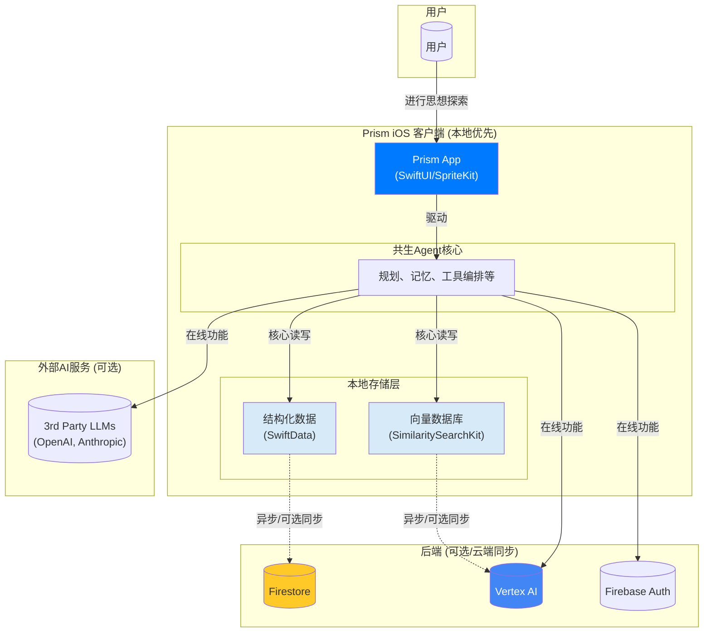
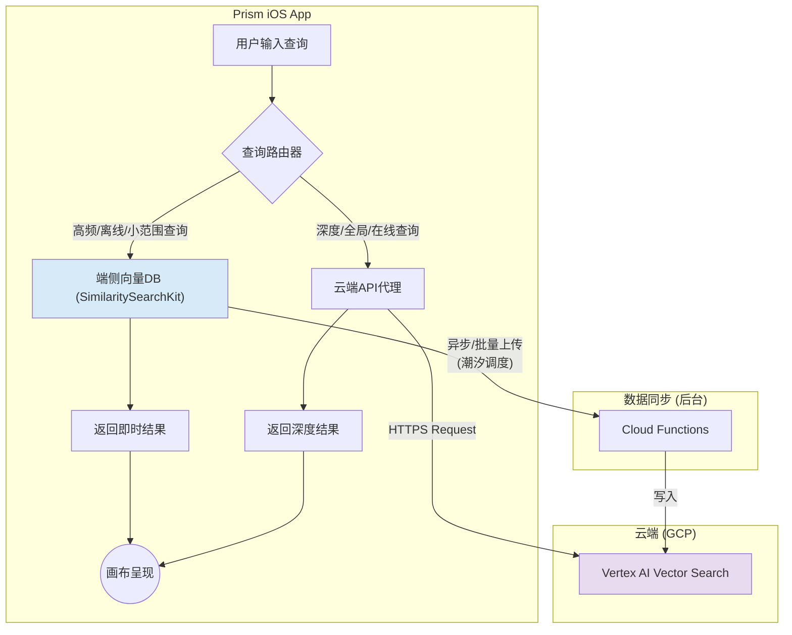

# Prism V7 设计文档：02 - 共生Agent技术架构

---

### **1. 文档目标与核心问题**

本文档旨在将 `01_共生认知系统全景解析.md` 中提出的“促生认知”哲学，转化为一个具体、可执行的技术架构蓝图。它直接回应了构建高级AI Agent的核心挑战：

> **“一堆功能谁都会，但那不是Agent... 核心问题是缺少Task Planner和Memory Manager去管流程，导致越做越像个按钮式工具。”**

本架构的目标，就是设计一个超越“按钮式工具”的、真正具备自主规划、记忆、执行与恢复能力的**共生Agent核心 (Symbiotic Agent Core)**。这个核心是驱动Prism所有智能功能的心脏。

---

### **2. 宏观系统架构 (System Context)**

在深入Agent核心的内部构造之前，我们首先建立一个C4-Level 1的系统上下文视图。本系统遵循**本地优先 (Local-First)**的设计哲学，确保核心功能在离线状态下依然强大、可用，并将云端作为可选的、用于同步和增强的扩展层。

---

### **3. Agent核心的五大架构支柱**

为实现一个鲁棒且智能的Agent，其架构必须建立在以下五个紧密协作的核心支柱之上。这五个支柱共同构成了Agent的“心智”与“神经系统”。

#### **3.1. 支柱一：规划层 (Planning Layer) - Agent的"前额叶皮层"**

*   **🎯 目的 (Purpose):** 解决"逻辑扁平、不会思考"的问题。将用户模糊、宏大的意图（如"帮我分析这个商业点子"）分解成一个清晰、有序、可执行的内部行动序列。
*   **⚙️ 核心职责 (Responsibilities):**
    1.  **任务分解 (Task Decomposition):** 采用**思维链 (Chain of Thought, CoT)** 或 **推理-行动循环 (ReAct)** 等模式，将复杂任务分解为一系列更小的、可管理的子任务。
    2.  **依赖管理 (Dependency Management):** 理解子任务间的逻辑关系和依赖顺序（例如，必须先获取数据，才能进行分析）。
    3.  **动态重规划 (Dynamic Re-planning):** 根据新信息或执行失败，能够灵活地调整、修改或中止原计划。
    4.  **意图理解 (Intent Recognition):** 识别用户的真实意图，即便其表述是模糊的。
    5.  **认知流状态管理 (Cognitive Flow State Management):** 基于用户当前认知状态和上下文，智能推荐最适合的功能，避免认知过载。只在合适的时机激活相关的认知阶段。
*   **💡 技术实现思路 (Implementation Ideas):**
    *   通过向一个高阶LLM（如GPT-4/Claude 3 Opus）提供一个包含可用工具列表和用户请求的元提示(meta-prompt)，让其输出一个结构化（如JSON格式）的执行计划。
    *   对于周期性或后台任务（如"孵化"阶段的灵感探索），规划层可以生成低优先级的思考与探索任务，交由"潮汐调度"系统执行。
    *   集成**认知流状态引擎**，通过分析用户行为模式（节点创建频率、搜索行为、编辑模式等）自动识别当前认知阶段，并智能推荐相应功能。

#### **3.2. 支柱二：记忆系统 (Memory System) - Agent的"海马体与新皮层"**

*   **🎯 目的 (Purpose):** 解决"上下文交互是大坑、没有长期记忆"的问题。为Agent提供一个可靠的、分层的记忆中枢，使其能够记住并有效利用历史信息。
*   **⚙️ 核心职责 (Responsibilities):**
    1.  **短期工作记忆 (Working Memory):** 作为一个高速缓存，存储当前任务执行过程中的即时信息（如用户刚刚的回复、工具调用的中间结果）。任务结束后可清空。
    2.  **长期情景记忆 (Episodic Memory):** 持久化存储与用户的完整对话历史，使得Agent能回忆起"我们上次聊到了什么"。
    3.  **长期语义/程序记忆 (Semantic/Procedural Memory):** 存储从交互中习得的事实、知识、用户偏好（如"用户偏爱简洁界面"），以及被验证有效的工作流。这是实现个性化的基础。
    4.  **建立人机信任 (Trust & Attribution):** 严格执行 **思想的归因链协议 (Chain of Attribution Protocol)**。任何由AI生成的新信息节点，都必须在数据模型层面，以元数据形式记录其推理所依赖的**所有"源节点"的ID**。这是将AI"思考过程"透明化，建立用户信任的基石。
    5.  **配置记忆 (Configuration Memory):** 存储用户的个性化配置、功能偏好和系统行为模式，为Agent提供上下文感知的配置适应能力。
*   **💡 技术实现思路 (Implementation Ideas):**
    *   **短期记忆:** 在iOS端，可使用`@StateObject`或专门的状态管理容器实现，随任务生命周期创建和销毁。
    *   **长期记忆:**
        *   使用 **SwiftData** 在本地存储结构化的情景、语义记忆，并强制要求数据模型包含`source_node_ids`字段以实现归因链。
        *   使用 **混合式向量数据库架构** (详见5.3节) 对所有思想节点、对话历史进行嵌入(Embedding)，实现高效的**语义检索 (RAG)**。
        *   通过一个独立的同步服务，将本地数据异步、可选地同步到 **Firebase Firestore**。
    *   **配置记忆:** 集成分层配置架构，使记忆系统能够根据用户行为模式动态调整配置参数和功能权限。

#### **3.3. 支柱三：工具编排层 (Tool Orchestration Layer) - Agent的"小脑与运动神经"**

*   **🎯 目的 (Purpose):** 解决"怎么调、调完干嘛、全靠瞎蒙"的问题。作为规划层与具体工具之间的智能调度中心。
*   **⚙️ 核心职责 (Responsibilities):**
    1.  **智能选型 (Tool Selection):** 根据规划层下达的指令，从"工具箱"中选择最合适的工具。
    2.  **参数合成 (Parameter Synthesis):** 自动从**记忆系统**中提取并组合工具执行所需的精确参数。
    3.  **结果解析 (Result Parsing):** 将工具返回的原始数据（如JSON、API-response）解析、提炼成对规划层有意义的自然语言"观察结果(Observation)"。
    4.  **权限与安全 (Permissions & Safety):** 管理工具的使用权限，确保Agent不会执行危险或未经授权的操作。
    5.  **动态配置调度 (Dynamic Configuration Routing):** 根据配置管理系统的动态路由规则，智能选择AI模型和提示词模板，实现成本优化和性能最大化。
    6.  **智能功能推荐 (Smart Feature Recommendation):** 基于用户当前上下文和历史行为模式，主动推荐最相关的工具和功能，降低用户的认知负荷。
    7.  **成本控制与监控 (Cost Control & Monitoring):** 实时监控AI调用成本，实施用户级别的使用量限制和成本上限保护，确保商业模式的可持续性。
*   **💡 技术实现思路 (Implementation Ideas):**
    *   为每个在 `01` 号文档中提到的"AI身份"（如逻辑审查官、人生教练）都注册为一个可用的"工具"。
    *   工具的定义是声明式的，包含：名称、描述、输入参数模式(JSON Schema)、输出。这使得规划层可以理解并决定如何使用它们。
    *   集成AI模型路由器，根据任务复杂度、用户权限、成本限制等因素动态选择最优的AI模型配置。
    *   实现**意图识别引擎**，通过分析用户行为模式（如连续创建节点→推荐孵化模式，频繁搜索→推荐检索优化，长时间编辑→推荐AI透镜）自动推荐相关功能。
    *   集成**成本监控系统**，实时追踪每个用户的AI调用成本，实施动态限制机制（软限制：降速提醒，硬限制：暂停服务），确保单用户月成本不超过预设上限。

#### **3.4. 支柱四：状态管理层 (State Management Layer) - Agent的“自主神经系统”**

*   **🎯 目的 (Purpose):** 解决“Agent总是中间断线、状态不更新”的问题。为Agent的每一个任务提供可靠的状态追踪和持久化。
*   **⚙️ 核心职责 (Responsibilities):**
    1.  **任务持久化 (Persistence):** 确保即使用户关闭App或切换网络，长时间运行的任务也能在下次启动时从断点处恢复。
    2.  **状态追踪 (State Tracking):** 为每个任务及其子步骤维护一个清晰的状态机（如：`pending`, `running`, `success`, `failed`）。
    3.  **可观测性 (Observability):** 提供清晰的日志和追踪能力，使开发者能够快速定位Agent“卡住”的原因，是调试和优化的前提。
*   **💡 技术实现思路 (Implementation Ideas):**
    *   在iOS端，可以利用Swift的 **Actor模型** 来构建线程安全的任务状态管理器。
    *   将任务的关键状态节点（如ID, status, current_step, variables）持久化到本地数据库（如SwiftData）或Firebase Firestore。

#### **3.5. 支柱五：错误恢复层 (Error Recovery Layer) - Agent的“免疫系统”**

*   **🎯 目的 (Purpose):** 解决“失败了咋办”的问题。赋予Agent韧性，使其在面对真实世界的不确定性时，不会轻易崩溃。
*   **⚙️ 核心职责 (Responsibilities):**
    1.  **自动重试 (Retry):** 对于瞬时错误（如网络抖动），自动进行有限次数的重试。
    2.  **备用方案 (Fallback):** 当主工具或API失败时，尝试调用功能类似的备用工具。
    3.  **请求澄清 (Clarification):** 当失败原因是由于信息不足时，主动向用户提问以获取必要信息。
    4.  **优雅降级 (Graceful Degradation):** 当所有尝试都失败后，向规划层报告失败并说明原因，由规划层决定是中止整个任务，还是跳过此步继续。
*   **💡 技术实现思路 (Implementation Ideas):**
    *   在工具编排层，为工具调用包裹一层带有错误处理逻辑的执行器(Executor)，该执行器内置了重试、降级等策略。

---

### **4. 架构与Prism认知模型的映射**

本技术架构是实现 `01` 号文档中十个认知阶段的底层支撑。

*   **I. 捕获 (Capture):** 主要由 **记忆系统** 实现，负责思想节点的持久化。
*   **II. 孵化 (Incubation):** 由 **规划层** 生成后台探索任务，调用 **记忆系统** 的语义搜索能力发现弱关联。
*   **III. 探索 (Exploration):** **规划层** 为“专注密室”创建一个限定上下文的子任务，**记忆系统** 提供限定范围的知识。
*   **IV. 关联 (Structuring):** **规划层** 接收用户指令，通过 **工具编排层** 调用“思想建筑师”AI工具，由 **记忆系统** 保证结果的归因链。
*   **V. 检索 (Retrieval):** 直接由 **记忆系统** 的混合式向量搜索能力提供支持。
*   **VI. 传承 (Crystallization):** **规划层** 创建“生成摘要”任务，调用NLP工具，**状态管理层** 确保这类长任务的可靠执行。
*   **VII. 情感共鸣 (Emotional Resonance):** **记忆系统** 存储情感元数据，并允许通过情感进行检索。
*   **VIII. 身份模拟 (Identity Simulation):** 一个典型的复杂任务，由 **规划层** 主导，**工具编排层** 多次调用“推演AI”和“价值观AI”，**记忆系统** 提供用户核心价值，**错误恢复层** 保证推演的鲁棒性。
*   **IX. 建构性遗忘 (Forgetting):** **规划层** 的后台任务调用“重要性评分AI”工具，更新 **记忆系统** 中节点的元数据。
*   **X. 集体心流 (Collective Ideation):** **规划层** 识别对话僵局，调用 **工具编排层** 的“中立引导AI”工具。

---

### **5. 技术选型与平台战略**

#### **5.1. 前端技术栈 (Client-Side Stack)**

*   **核心应用与UI (Core App & UI):** **Swift & SwiftUI**
    *   **理由:** Apple生态首选，其声明式语法非常适合构建Prism这种需要实时响应状态变化的复杂、动态界面。
*   **核心画布构建 (Canvas Construction):** **SpriteKit on SwiftUI**
    *   **理由:** 为实现“物理隐喻”、大量节点的高性能渲染、自定义手势以及复杂的视觉效果（如“情感光晕”、“认知迷雾”），我们需要一个强大的2D渲染引擎。将`SpriteView`嵌入到SwiftUI视图中，可以兼得SpriteKit的性能和SwiftUI的状态管理便利性。
*   **高性能图形与视觉效果 (Graphics & VFX):** **Metal**
    *   **理由:** 对于SpriteKit无法直接实现的自定义着色器效果，我们将通过`SKShader`直接编写Metal着色器代码。
*   **高级状态管理 (State Management):** **Swift Observation Framework**
    *   **理由:** Swift 5.9+ 的 `Observation` 框架是处理复杂状态的现代化首选。
*   **触觉反馈 (Haptics):** **Core Haptics**
    *   **理由:** 实现“可触摸的交互”的核心，必须深度集成。
*   **本地持久化 (Local Persistence):** **SwiftData**
    *   **理由:** CoreData的现代化替代品，与SwiftUI集成更原生，用于存储离线数据和任务状态。

#### **5.2. 后端与云平台战略 (Backend & Cloud Strategy)**

我们的后端与云平台战略，由`01`号文档中定义的两大核心技术原则驱动，旨在构建一个既能利用当前最强模型能力，又具备长期演进性和成本效益的系统。

**原则一：AI模型抽象层 (Model Abstraction Layer)**
*   为避免技术锁定，我们通过统一的抽象层调用AI模型。这使得底层模型可像插件一样被热插拔，而上层功能保持稳定。

**原则二：计算资源的潮汐调度 (Tidal Scheduling of Compute)**
*   为平衡成本与体验，我们将AI计算任务按紧急程度划分为三级（瞬时级、交互级、休眠级）并进行智能调度，将总体计算成本和设备负担降至最低。

**最终技术选型决策:**

基于以上原则，并综合对开发速度、维护成本和生态系统成熟度的考量，我们决定在当前阶段**全面采用Google Cloud Platform (GCP)作为核心云平台**。

*   **结构化数据与同步 (Structured Data & Sync):** **Firebase Firestore**
*   **云端逻辑与后台任务 (Cloud Logic & Backend Tasks):** **Cloud Functions for Firebase**
*   **核心AI能力 (Core AI Capabilities):** **Vertex AI (Gemini & Vector Search)**

---
#### **5.3. 关键架构模式解析 (Key Architectural Patterns Explained)**

*   **安全AI代理模式 (Secure AI Proxy Pattern)**
    *   **问题:** 如何在为用户提供“新手AI赠礼”的同时，保护我们自己的AI服务商API密钥不被泄露，从而避免灾难性的资金损失？
    *   **解决方案:** **绝不**在客户端代码中直接包含或调用我们自己的密钥。所有由我方承担成本的AI调用，都必须通过一个**安全的云函数代理 (Cloud Function Proxy)**。
    *   **工作流:** 
        1.  iOS客户端请求Cloud Function。
        2.  Cloud Function在安全的云端环境中，验证用户身份和“AI体验点数”余额。
        3.  验证通过后，函数使用**存储在云端环境变量中**的密钥，调用真正的AI服务（如Gemini）。
        4.  函数将结果返回给客户端，并更新点数。
    *   **结论:** Cloud Function是我们的**安全防火墙**和**成本控制阀门**，是此商业模式的技术基石。

*   **混合式向量搜索模式 (Hybrid Vector Search Pattern)**
    *   **问题:** 如何兼顾即时响应、离线可用、搜索深度和运营成本？
    *   **解决方案:** 融合端侧与云端的能力，让它们做各自最擅长的事。
    *   **端侧 (SimilaritySearchKit):** 承担高频、小范围、上下文相关的**即时搜索**，并保证**离线可用性**和**隐私**。如同个人书房，快速且免费。纯Swift实现，避免C++集成复杂性。
    *   **云端 (Vertex AI):** 承担低频、高价值的**全局深度搜索**，并为未来的AI模型微调提供数据源。如同国家图书馆，藏书量无限但需要成本。

---

#### **5.4. 混合式向量搜索架构 (Hybrid Vector Search Architecture)**

*   **端侧向量数据库 (On-Device Vector DB):**
    *   **技术:** **SimilaritySearchKit** - 纯Swift实现的向量搜索库。
    *   **职责:** 负责高频的、上下文相关的即时搜索，并保证离线可用性。
    *   **优势:** 无需C++桥接，大幅降低集成复杂度和维护成本。
*   **云端向量数据库 (Cloud Vector DB):**
    *   **技术:** **GCP: Vertex AI Vector Search**。
    *   **职责:** 负责需要海量计算的深度、全局搜索，并作为未来高级AI功能的数据源。

**架构与数据流:**

---

### **6. 功能配置管理架构 (Configuration Management Architecture)**

#### **6.1. 配置系统设计哲学**

功能配置系统是Prism V7架构中的"神经系统"，它需要在保证系统健壮性的同时，提供足够的灵活性来支持产品的快速迭代和市场适应。配置系统必须遵循以下核心原则：

*   **分层递进 (Layered Progression):** 配置以层级结构组织，高层级配置可以覆盖低层级配置，实现精确控制。
*   **实时响应 (Real-time Response):** 关键配置变更能够在不重启应用的情况下立即生效。
*   **健壮容错 (Robust Fallback):** 配置加载失败时，系统能够优雅降级到安全的默认配置。
*   **版本可控 (Version Control):** 所有配置变更都有版本追踪和回滚能力。

#### **6.2. 分层配置架构**

**层级一：全局配置 (Global Configuration)**
*   **职责:** 定义系统级的基础设置，如AI模型列表、功能开关、业务规则等。
*   **存储位置:** Firebase Firestore的专用collection
*   **更新频率:** 低频，通常随版本发布更新
*   **影响范围:** 所有用户和环境

**层级二：环境配置 (Environment Configuration)**
*   **职责:** 区分开发、测试、生产环境的特定配置。
*   **存储位置:** Firebase Firestore，按环境分collection
*   **更新频率:** 中频，随环境变化更新
*   **影响范围:** 特定环境的所有用户

**层级三：用户配置 (User Configuration)**
*   **职责:** 用户个性化设置、订阅级别相关功能权限。
*   **存储位置:** Firebase Firestore用户文档
*   **更新频率:** 高频，随用户行为变化
*   **影响范围:** 单个用户

**层级四：会话配置 (Session Configuration)**
*   **职责:** 临时的、会话级别的配置，如A/B测试分组。
*   **存储位置:** 设备内存和本地缓存
*   **更新频率:** 最高频，每次会话可能变化
*   **影响范围:** 单次会话

#### **6.3. 核心配置组件**

**AI模型配置管理 (AI Model Configuration)**
*   **模型注册表:** 维护所有可用AI模型的元数据，包括能力标签、成本信息、性能指标。
*   **动态路由规则:** 基于用户上下文、请求类型、成本优化等条件，自动选择最适合的模型。
*   **故障转移策略:** 当主选模型不可用时，自动切换到备用模型，确保服务连续性。

**提示词模板管理 (Prompt Template Management)**
*   **模板版本控制:** 每个提示词模板都有版本标识，支持A/B测试和渐进式发布。
*   **变量参数化:** 提示词中的动态部分通过变量定义，支持运行时替换。
*   **性能监控:** 跟踪不同模板的效果指标，为优化提供数据支撑。

**功能开关系统 (Feature Flag System)**
*   **渐进式发布:** 新功能可以针对特定用户群体逐步开放，降低风险。
*   **权限控制:** 基于用户订阅级别、地理位置等条件控制功能访问权限。
*   **实时切换:** 支持运营团队实时开启或关闭功能，无需应用更新。

#### **6.4. 配置同步机制**

**本地缓存策略 (Local Caching Strategy)**
*   **多级缓存:** 内存缓存用于会话级配置，磁盘缓存用于持久化配置。
*   **智能预加载:** 根据用户使用模式，预加载可能需要的配置数据。
*   **离线优先:** 即使在网络不可用时，也能基于本地缓存正常运行核心功能。

**实时同步机制 (Real-time Sync Mechanism)**
*   **Firebase监听:** 利用Firebase Firestore的实时监听能力，捕获配置变更。
*   **增量更新:** 只同步发生变化的配置项，减少网络传输和处理开销。
*   **冲突解决:** 当本地和远程配置冲突时，按预定义的优先级规则解决。

#### **6.5. 配置验证与安全**

**配置完整性验证 (Configuration Integrity Validation)**
*   **结构验证:** 确保配置数据符合预定义的schema结构。
*   **逻辑验证:** 检查配置间的依赖关系和业务逻辑一致性。
*   **性能验证:** 验证配置不会导致性能问题或资源过度消耗。

**安全与权限控制 (Security & Access Control)**
*   **配置加密:** 敏感配置数据在传输和存储时进行加密。
*   **访问权限:** 不同角色对配置的读写权限严格分离。
*   **审计日志:** 记录所有配置变更的操作者、时间和原因。

#### **6.6. 运营管理工具集成**

**MVP1阶段：轻量级管理 (MVP1: Lightweight Management)**
*   **Firebase Console:** 利用Firebase原生控制台进行基础配置管理。
*   **Google Sheets集成:** 通过Apps Script实现配置的可视化编辑和批量导入。
*   **应用内开发者模式:** 为开发团队提供应用内的配置查看和调试工具。

**MVP2阶段：专业化运营 (MVP2: Professional Operations)**
*   **Retool集成:** 构建专业的配置管理界面，支持复杂的配置编辑和版本管理。
*   **自动化工作流:** 配置变更的审批、测试、发布流程自动化。
*   **监控和告警:** 配置异常、性能问题的实时监控和告警机制。

---

### **7. 画布渲染架构 (Canvas Rendering Architecture)**

为实现文档中描述的"物理隐喻"和"光影叙事"，我们采用分层渲染架构，在控制技术复杂度的同时，确保高质量的视觉呈现。

#### **7.1. 三层渲染架构 (Three-Layer Rendering Architecture)**

**第一层：SwiftUI - 信息与交互层 (Information & Interaction Layer)**
*   **核心职责:** 所有UI控件、文本渲染、手势捕获
*   **技术优势:** 世界级的文本渲染引擎，完善的可访问性支持
*   **实现方式:** 使用`ZStack`将`SpriteView`置于底层，通过共享`ViewModel`同步节点位置

**第二层：SpriteKit - 物理与布局层 (Physics & Layout Layer)**
*   **核心职责:** 场景图管理、物理模拟、基础交互逻辑、命中测试
*   **技术选择:** 使用`SKNode`管理节点位置，`SKFieldNode`实现漂移模式
*   **关键点:** 作为"舞台监督"，只关心元素位置和关系，不关心复杂视觉效果

**第三层：SKEffectNode - 视觉效果层 (Visual Effects Layer)**
*   **核心职责:** 情感光晕、认知迷雾、溶解效果等视觉特效
*   **技术选择:** 使用`SKEffectNode`配合Core Image滤镜，避免直接使用Metal
*   **优势:** 大幅降低开发成本，消除关键人风险，同时保持高质量视觉效果

#### **7.2. 动画系统 (Animation System)**

**实用主义动画金字塔 (Pragmatic Animation Pyramid)**
*   **塔基 - 流畅交互反馈 (必须实现):** 60fps的拖动、菜单弹出等基础交互
*   **塔身 - 叙事性转场 (重点投入):** 进入"专注密室"、生成"进化摘要"等核心体验
*   **塔尖 - 装饰性点缀 (可选/降级):** 复杂粒子效果，可在性能模式下禁用

**动画词典 (Animation Vocabulary)**
定义有限但表达力强的核心动画动词：
*   `emerge` (浮现) - 节点创建时的渐入效果
*   `settle` (落定) - 节点到达目标位置的缓动
*   `pulse` (脉动) - 情感节点的呼吸感
*   `dissolve` (溶解) - 使用`SKAction`组合实现遗忘效果
*   `connect` (连接) - 共鸣瞬现的金色连线动画

---

### **8. iOS客户端工程规范**

为保证V7版本的代码质量、可维护性和团队协作效率，我们将在V6规范的基础上，确立以下工程规范。所有工程实践都必须服务于 `01` 号文档中定义的核心设计哲学，特别是 **“渐进式显现 (Progressive Revelation)”** 和 **“可解释的魔法 (Explainable Magic)”** 两大原则，确保技术实现能够忠实地呈现产品的灵魂。

#### **8.1. App架构：MVVM-C**
*   **Model-View-ViewModel-Coordinator** 将继续作为我们的核心架构。
*   **Model**: 由 `SwiftData` 模型构成。
*   **View**: 纯粹的SwiftUI视图，**严禁**包含任何业务逻辑。过大的View必须拆分为更小的子View。
*   **ViewModel**: 处理业务逻辑、状态管理，并与服务层交互。
*   **Coordinator**: 管理页面导航和画布之间的复杂转场。

#### **8.2. 核心工程准则**
*   **SOLID原则**: 必须严格遵守，特别是**单一职责**、**接口隔离**和**依赖倒置**。
*   **协议驱动开发 (POP)**: 模块间的通信，必须通过定义的协议进行，严禁直接引用具体实现。
*   **文件大小限制**: 将"行数限制"作为"代码异味"的信号，触发Code Review而非机械执行。

#### **8.3. 依赖注入 (Dependency Injection)**
*   所有`Service`和`ViewModel`的依赖，都必须通过**构造器注入 (Initializer Injection)**。
*   我们将使用一个轻量级的DI容器（如 `Factory`）来管理依赖的注册和解析，以便于在正式环境和测试环境中切换实现。

#### **8.4. 测试策略与框架**
*   **测试金字塔**: 遵循 `单元测试 (70%) > 集成测试 (20%) > UI测试 (10%)` 的原则。
*   **分层确定性注入**: 为非确定性AI功能创建可配置的模拟层，使用黄金数据集进行回归测试。
*   **时间旅行调试**: 创建Debug Panel支持手动触发后台任务、加速时间、注入状态。

#### **8.5. 代码风格与格式化**
*   **代码风格**: 我们将采用社区公认的 [Swift API Design Guidelines](https://www.swift.org/documentation/api-design-guidelines/)。
*   **自动化格式化**: 项目将集成 **SwiftLint**，并在CI/CD流程中强制执行。所有代码在提交前必须通过Lint检查，以保证代码风格的绝对一致性。

本架构为Prism V7的开发提供了一个清晰、模块化且可演进的框架。接下来的工作将是分阶段实现这些支柱，并将其与UI/UX层进行深度集成。
