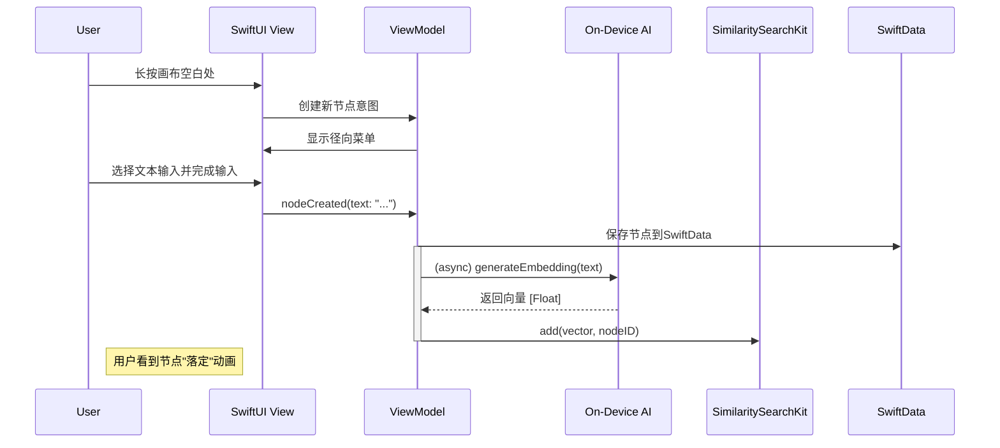
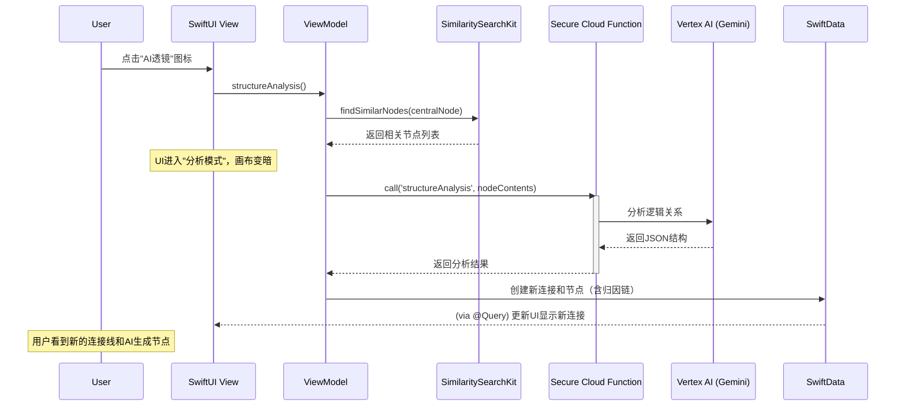
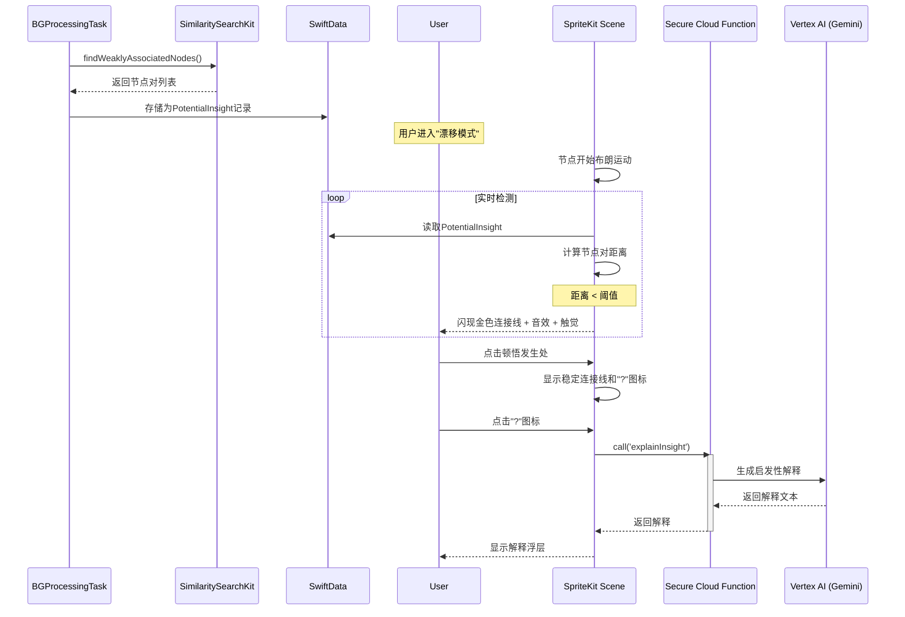
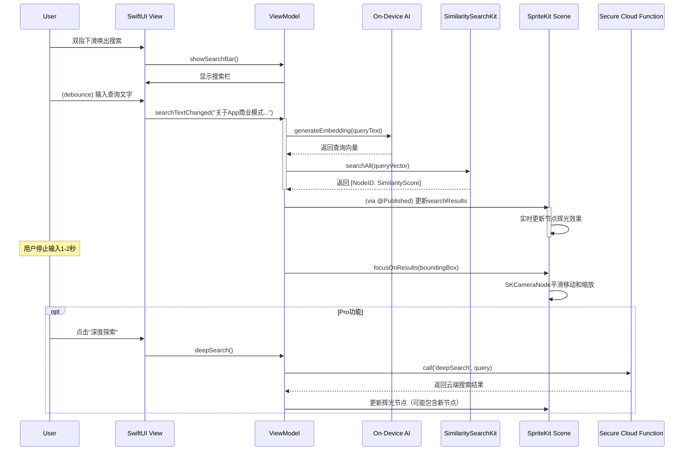
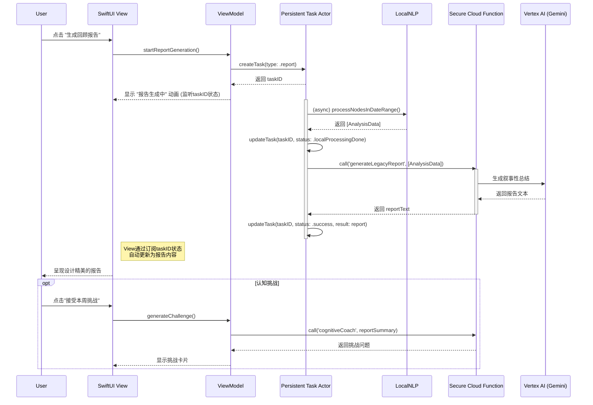
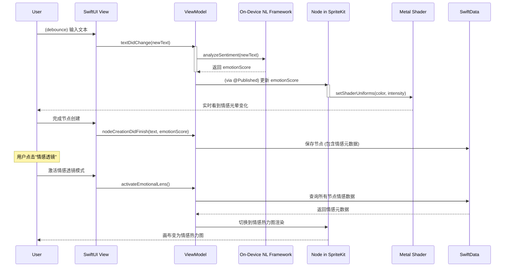
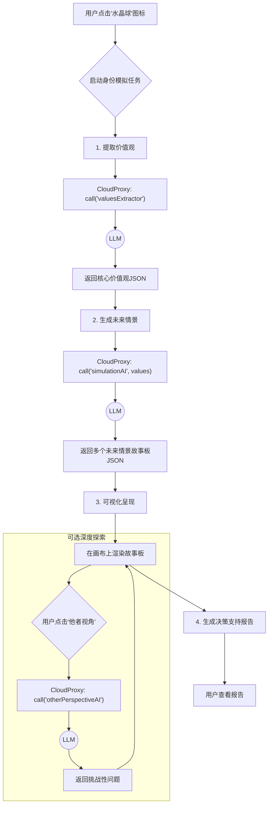
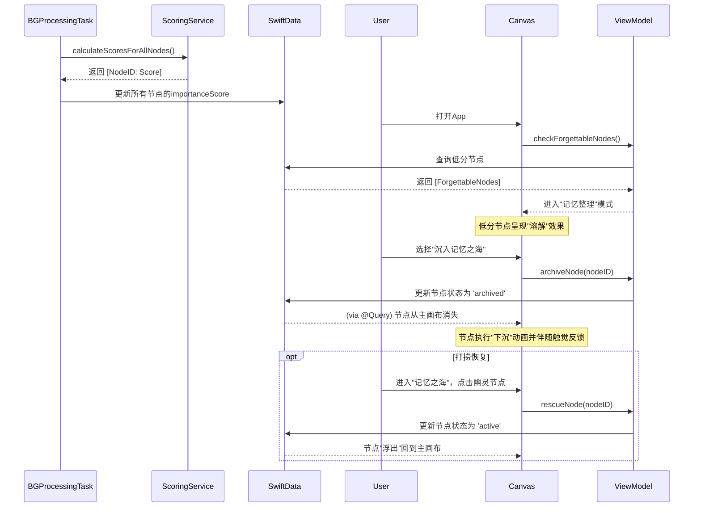
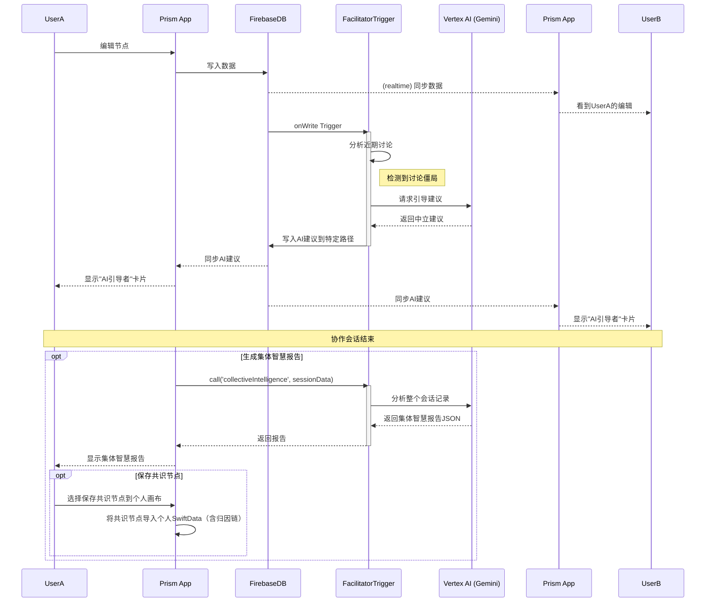
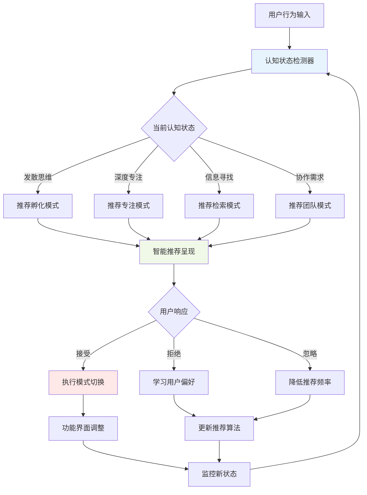

# Prism V7 设计文档：04 - UI/UX与核心工作流详解

---

### **引言：从哲学到体验的最后一公里**

本文档是连接 [01_共生认知系统全景解析.md](01_共生认知系统全景解析.md) 的设计哲学与 [02_共生Agent技术架构.md](02_共生Agent技术架构.md) 的技术实现之间的最终桥梁。其核心目标是，通过分镜故事板（Storyboard）的形式，将抽象的认知阶段，具体化为用户能看到、触摸到、并与之交互的完整体验流程。

这不仅是UI/UX设计文档，更是**AI行为的剧本**，它将详细规定在每个用户动作背后，我们的共生Agent应如何思考与行动。

---

### **核心工作流一：思想捕获 (Capture) - “让想法如呼吸般自然涌现”**

**对应认知阶段:** 第一阶段：捕获 (Capture) - 思想的播种
**核心设计原则:** 静谧科技 (Calm Technology), 最低摩擦 (Lowest Friction), 物理隐喻 (Physical Metaphors)
**AI核心身份:** 速记员 (Stenographer)

#### **1. 场景：用户在画布上，一个新想法萌生**

**分镜故事板 (Storyboard):**

| 步骤 (Step) | 用户所见 (UI/UX) & 所做 (Action) | AI所思 & 所为 (Behavior) | 技术实现映射 (Tech Mapping) |
| :--- | :--- | :--- | :--- |
| **1. 意图产生** | **用户所见:** 沉静、带有微妙背景纹理和呼吸感的无限画布。可能是空白，也可能已有其他想法节点。<br/><br/> **用户所做:** 在画布任意空白处**长按**。 | **AI所思:** "用户意图：创造新内容。当前认知档位：速记模式。"<br/><br/>**AI所为:** Agent核心的**规划层(Planning Layer)**识别到创造意图，但在速记模式下保持静默，进入待命状态。 | - **UI:** SwiftUI + `SpriteKit` Canvas<br/>- **Input:** `UIGestureRecognizer` |
| **2. 工具唤出** | **用户所见:** 长按处出现一个由中心向外扩散的、带有`Core Haptics`震动反馈的涟漪动画。涟漪中心浮现出一个极简的**径向菜单(Radial Menu)**，包含三个图标：**“文本”** (Text), **“语音”** (Voice)。<br/><br/> **用户所做:** 手指**不离开屏幕**，滑动到**“文本”**图标上。 | **AI所思:** “用户选择了文本输入。”<br/><br/>**AI所为:** **工具编排层 (Tool Orchestration)** 准备好文本输入工具。 | - **UI:** Custom SwiftUI view with animation.<br/>- **Haptics:** `Core Haptics` engine. |
| **3. 内容输入** | **用户所见:** 手指松开后，径向菜单消失，原地生成一个外观质朴、带有微微输入光标闪烁的新节点。键盘自动弹出。<br/><br/> **用户所做:** 输入文字：“一个关于‘促生认知’的App”。 | **AI所思:** "正在接收用户输入..."<br/><br/>**AI所为:** 无主动行为，等待输入完成。 | - **UI:** SwiftUI `TextField` within a custom node view. |
| **4. 捕获完成** | **用户所见:** 用户点击键盘"完成"或点击节点外部。键盘收起，节点的光标消失，尺寸根据内容自适应，并产生一个轻微的"落定"动画和触觉反馈，仿佛一块石头落入水中。<br/><br/> **用户所做:** 完成输入。 | **AI所思:** "捕获完成，需进行持久化与向量化。"<br/><br/>**AI所为:**<br/>1. **记忆系统 (Memory System):** 将新节点内容和元数据（创建时间等）通过**SwiftData**保存到本地。<br/>2. **记忆系统 (Memory System):** 异步调用**Core ML**嵌入模型，将节点文本内容转换为向量，通过**SimilaritySearchKit**存入本地向量数据库。<br/>3. **状态管理 (State Management):** 任务状态从 `creating` 变为 `completed`。| - **Data:** `SwiftData` for persistence.<br/>- **AI:** `SimilaritySearchKit` for vector search.<br/>- **State:** Actor model for task state. |
| **5. 情景感知 (可选)** | **用户所见:** 节点右下角出现一个微小的、半透明的地点图标。长按该图标，会显示“创建于：[地点名称], [天气]”。<br/><br/> **用户所做:** (被动) 用户在创建时授权了位置信息。 | **AI所思:** “用户已授权，捕获附加情景元数据。”<br/><br/>**AI所为:** 在步骤4的同时，**记忆系统**调用系统API，获取地理位置、天气等信息，作为元数据一并存入SwiftData。 | - **System API:** `CoreLocation` for location data.<br/>- **Networking:** API call to a weather service. |

#### **技术实现详解与流程图 (Technical Implementation Details & Flowchart)**

**AI 调用关系 (AI Call Relationships):**

此阶段**不涉及对云端LLM（大语言模型）的调用**，所有AI计算均在设备端(On-Device)完成，以保证极致的速度和隐私。

1. **本地文本向量化 (Local Text Embedding):**
   - **调用时机:** 当用户完成一个节点的输入后，异步触发。
   - **调用内容:** 一个内部的 `AIService` 会调用一个本地嵌入模型 (On-Device Embedding Model)，将节点的文本内容转换为一个向量 (Vector)。
   - **技术选型:** 可以使用 CoreML 转换过的轻量级模型，例如 MobileBERT 或 Sentence-Transformers 的某个变体。
   - **接口:** `AIService.generateEmbedding(for: String) async -> [Float]`

2. **本地向量存储 (Local Vector Storage):**
   - **调用时机:** 获取到文本向量后。
   - **调用内容:** `MemorySystem` (记忆系统) 将上一步生成的向量和对应的节点ID存入本地的 `SimilaritySearchKit` 向量数据库中。
   - **接口:** `VectorDBService.add(vector: [Float], with id: String)`

**实现细节 (Implementation Details):**

1. **视图层 (View):** 使用 `UIGestureRecognizer` 捕获画布上的长按 (Long Press) 和拖动 (Drag) 手势，以唤出并选择径向菜单 (Radial Menu)。当用户完成输入（例如点击键盘"完成"），`View` 通知其关联的 `ViewModel`。

2. **视图模型层 (ViewModel):** 接收到 `View` 的通知后，`ViewModel` 创建一个 `Node` 数据模型实例。调用 `PersistenceService` (持久化服务) 将这个 `Node` 对象保存到 `SwiftData` 中。**异步启动 (Asynchronously Start)** AI处理流程。

3. **服务层 (Service Layer):** `AIService`: 内部封装了 CoreML 模型的加载和调用逻辑。`VectorDBService`: 封装了与 `SimilaritySearchKit` 交互的代码，负责索引的增删查改，无需C++桥接。`PersistenceService`: 封装了所有与 `SwiftData` 的交互。



---

### **核心工作流二：关联与结构化 (Structuring) - "AI透镜：看见思考的脉络"**

**对应认知阶段:** 第四阶段：关联与结构化 (Association & Structuring) - 碎片的连接
**核心设计原则:** 可解释的魔法 (Explainable Magic), 光影叙事 (Light & Shadow Narrative), 渐进式显现 (Progressive Revelation)
**AI核心身份:** 思想建筑师 (Thought Architect) / 逻辑审问者 (Logic Inquisitor)

#### **1. 场景：画布上散落着多个想法节点，用户希望梳理它们之间的关系**

**分镜故事板 (Storyboard):**

| 步骤 (Step) | 用户所见 (UI/UX) & 所做 (Action) | AI所思 & 所为 (Behavior) | 技术实现映射 (Tech Mapping) |
| :--- | :--- | :--- | :--- |
| **1. 意图产生** | **用户所见:** 画布上有多个相关的节点，如“用户痛点：信息过载”、“解决方案：智能遗忘”、“核心理念：促生认知”。<br/><br/> **用户所做:** 在一个核心节点上（如“核心理念”）**单击 (Single Tap)**。 | **AI所思:** “用户正在聚焦于此节点，准备提供上下文工具。”<br/><br/>**AI所为:** Agent进入待命状态，准备根据用户下一步操作提供相关工具。 | - **UI:** `SpriteKit` node selection.<br/>- **Input:** `UIGestureRecognizer` |
| **2. 工具唤出** | **用户所见:** 被选中的节点周围出现一个更精巧的环形菜单，菜单上是一个**透镜图标 (AI透镜)**。菜单的出现有微妙的动画和触觉反馈。<br/><br/> **用户所做:** 点击**“AI透镜”**图标。 | **AI所思:** “用户请求对当前上下文进行结构化分析。这是一个复杂任务，需要启动规划流程。”<br/><br/>**AI所为:** **规划层 (Planning Layer)** 被激活，识别到用户意图为“结构化分析”。 | - **UI:** Custom SwiftUI context menu.<br/>- **Haptics:** `Core Haptics` engine. |
| **3. AI执行中** | **用户所见:** 整个画布的色调变暗，进入一个专注的"分析模式"。AI透镜图标处发出微光，并围绕所有相关节点画出一个动态的、发光的虚线选择框。虚线框内的节点呈现呼吸灯效果，框外节点进一步变暗。UI上出现提示："AI正在审视您的思想脉络..."。 | **AI所思:** "任务已分解：1.检索相关节点。2.调用LLM分析关系。3.生成结构化结果。4.可视化呈现。当前认知档位：审问模式。"<br/><br/>**AI所为 (异步执行):**<br/>1. **记忆系统:** 以当前节点为中心，通过**SimilaritySearchKit**进行语义搜索，找到最相关的Top-K个节点。<br/>2. **规划层:** 生成一个结构化的任务计划。<br/>3. **工具编排层:** 调用"**思想建筑师**"AI工具，将相关节点的内容打包，发送给LLM（BYOK模式直接调用，否则通过**安全AI代理**），并附上指令："请识别这些观点之间的逻辑关系（如因果、矛盾、支撑），并以JSON格式返回。"<br/>4. **状态管理层:** 追踪任务状态为`running`。 | - **UI:** `SKEffectNode` for dimming & highlight effects.<br/>- **AI:** SimilaritySearchKit search, BYOK/Cloud Function call.<br/>- **State:** Actor model for task state. |
| **4. 结果呈现** | **用户所见:** 分析完成后，暗色背景褪去。节点间自动生成了新的连接线，线的类型和颜色有明确区分：**粗实线**代表“强支撑”，**虚线**代表“弱关联”，**红色波浪线**代表“潜在矛盾”。一个由AI生成的新节点（如“核心矛盾点”）出现在画布上。<br/><br/>**用户所做:** 查看AI生成的结果。 | **AI所思:** “任务成功，解析结果并更新UI。必须遵守‘归因链协议’。”<br/><br/>**AI所为:**<br/>1. **工具编排层:** 解析LLM返回的JSON结果。<br/>2. **记忆系统:** 在**SwiftData**中创建新的连接线数据，并创建新的AI生成节点。**关键：** 在该新节点的元数据中，写入其所有**来源节点的ID列表**。<br/>3. **状态管理层:** 任务状态更新为`success`。| - **UI:** `SpriteKit` to draw new nodes and connections.<br/>- **Data:** `SwiftData` persistence with `source_node_ids`. |
| **5. 可解释性** | **用户所见:** AI生成的新节点上，有一个小小的"i"(info)图标。<br/><br/> **用户所做:** 点击"i"图标。<br/><br/> **用户所见:** 一个半透明的浮层出现，上面写着："此结论基于您关于'A'、'B'和'C'的观点推导得出。" 同时，画布上的A、B、C三个源节点会高亮闪烁一下，并有能量流动的连线指向这个新节点。 | **AI所思:** "用户请求溯源，展示归因链。"<br/><br/>**AI所为:**<br/>1. **记忆系统:** 读取AI节点的`source_node_ids`元数据。<br/>2. **UI驱动:** 向UI层提供需要高亮的节点ID列表和连接关系。 | - **UI:** Custom info-popover view.<br/>- **Data:** Reading metadata from the selected node object. |

#### **技术实现详解与流程图 (Technical Implementation Details & Flowchart)**

**AI 调用关系 (AI Call Relationships):**

1. **本地语义搜索 (Local Semantic Search):**
   - **调用时机:** 用户点击"AI透镜"图标后。
   - **调用内容:** `MemorySystem` 以当前节点为中心，在本地 `Faiss` 数据库中进行语义搜索，找到最相关的Top-K个节点。
   - **接口:** `VectorDBService.findSimilarNodes(to: centralNodeVector, topK: 5) async -> [Node]`

2. **云端逻辑分析 (Cloud-based Logical Analysis):**
   - **调用时机:** 获取到相关节点列表后。
   - **调用方式:** **严格遵守"安全AI代理模式 (Secure AI Proxy Pattern)"**。客户端**绝不**直接调用LLM。
   - **客户端调用:** 调用一个安全的云函数 (Cloud Function)。
   - **云函数调用:** 位于GCP的 `structureAnalysis` 云函数接收请求，函数内部使用储存在云端环境变量中的API Key，调用 **Vertex AI (Gemini)**。
   - **Prompt (提示词):** "请识别以下观点之间的逻辑关系（如因果、矛盾、支撑），并以JSON格式返回：`{ connections: [{source_id: 'A', target_id: 'B', type: 'support'}], new_nodes: [{title: '核心矛盾', content: '...', source_ids: ['A', 'C']}] }`"

**实现细节 (Implementation Details):**

1. **状态流转 (State Flow):** `ViewModel` 维护一个任务状态，如 `enum AITaskState { .idle, .searchingLocally, .callingCloud, .parsing, .success, .error }`。点击"AI透镜"后，状态变为 `.searchingLocally`，UI进入"分析模式"。

2. **任务执行 (Task Execution):** `ViewModel` 调用 `VectorDBService` 获取相关节点。状态变为 `.callingCloud`。`ViewModel` 将节点内容打包，调用 `CloudFunctionService`。

3. **数据持久化与归因 (Persistence & Attribution):** `ViewModel` 解析JSON。对于 `connections` 数组，创建新的 `Link` 对象并存入 `SwiftData`。对于 `new_nodes` 数组，创建新的 `Node` 对象，并**严格遵守"思想的归因链协议"**，将其 `source_node_ids` 属性填入JSON中提供的值。



---

### **核心工作流三：孵化 (Incubation) - “邂逅一次计划外的顿悟”**

**对应认知阶段:** 第二阶段：孵化 (Incubation) - 无意识的酝酿
**核心设计原则:** 静谧科技 (Calm Technology), 侘寂美学 (Wabi-Sabi), 知性与内省 (Intellectual & Introspective)
**AI核心身份:** 灵感缪斯 (Muse)

#### **1. 场景：用户长时间未与App交互，或主动进入“漂移模式”。App处于空闲状态。**

**分镜故事板 (Storyboard):**

| 步骤 (Step) | 用户所见 (UI/UX) & 所做 (Action) | AI所思 & 所为 (Behavior) | 技术实现映射 (Tech Mapping) |
| :--- | :--- | :--- | :--- |
| **1. AI后台酝酿** | **用户所见:** 无。此过程完全在后台发生，对用户透明。<br/><br/> **用户所做:** (被动) 用户允许了后台App刷新，或设备正在充电且连接Wi-Fi。 | **AI所思:** “进入‘休眠级’计算窗口，执行低优先级孵化任务，寻找潜在的灵感火花。”<br/><br/>**AI所为 (后台异步):**<br/>1. **规划层:** 遵循**潮汐调度原则**，启动一个低优先级的“孵化”任务。<br/>2. **记忆系统:** 随机选择一个近期创建或编辑的节点作为“种子”，通过**Faiss**在**整个**思想库中寻找与之存在**“弱关联”**（即语义相似度中等，非强相关）的遥远节点。<br/>3. **记忆系统:** 如果找到了这样一对（或多对）节点，将它们的ID作为一个“潜在顿悟”记录下来，并赋予一个初始的“能量值”。 | - **System API:** `BGProcessingTask` for background tasks.<br/>- **AI:** Faiss similarity search with custom threshold.<br/>- **Data:** `SwiftData` to store "potential insight" records. |
| **2. 漂移模式** | **用户所见:** 画布上的所有节点开始以极其缓慢、无规律、类似布朗运动的方式进行“漂移”，整体视觉非常梦幻、催眠。<br/><br/> **用户所做:** 只是静静地观察，或者在放空大脑时将App作为屏保。 | **AI所思:** “用户正在寻求放松或无目的的漫游，这是展示‘顿悟’的最佳时机。”<br/><br/>**AI所为:** 驱动UI层的节点进行随机、平滑的移动。 | - **UI:** `SpriteKit` physics engine or custom animation logic. |
| **3. 顿悟发生** | **用户所见:** 当两个被AI标记为“潜在顿悟”的节点，在漂移中**偶然靠近**到一定距离时，它们之间会突然闪现一条**短暂而明亮的金色连接线**。这条线出现1-2秒后便会优雅地消失，并伴随一声清脆、空灵的音效和一次微弱的`Core Haptics`反馈。<br/><br/> **用户所做:** (被动) 被这个意想不到的连接所吸引，可能会产生“哦？原来这两个东西有关系？”的想法。 | **AI所思:** “触发视觉与听觉事件，暗示一个潜在的深刻联系，但不强迫用户接受。”<br/><br/>**AI所为:** 监控“潜在顿悟”节点对的屏幕坐标，当距离小于阈值时，触发预设的“顿悟”视听效果。 | - **UI:** `SpriteKit` to draw temporary, animated connection with `Metal` shader.<br/>- **Audio:** `AVFoundation` to play sound.<br/>- **Haptics:** `Core Haptics` engine. |
| **4. 探索顿悟** | **用户所见:** 如果用户对刚才的连接感兴趣，他可以**在金色连接线消失的地方，单击画布**。<br/><br/> **用户所做:** 点击“顿悟”发生处。<br/><br/> **用户所见:** 刚才那两个节点会再次被一条**稳定的、半透明的金色连线**连接起来，并出现一个小的“？”图标。 | **AI所思:** “用户对这个‘顿悟’产生了兴趣，准备提供解释。”<br/><br/>**AI所为:** 响应用户的点击事件，将刚才临时的“顿悟”事件转化为一个可交互的UI元素。 | - **UI:** `SpriteKit` node interaction. - **Input:** `UIGestureRecognizer`. |
| **5. 可解释性** | **用户所见:** 点击"？"图标。<br/><br/> **用户所见:** 弹出一个浮层，上面写着："**一个未经审视的连接**：你的'A观点'似乎在探讨'**概念X**'，而你很久前提到的'B观点'，也在用不同方式描述'**概念X**'。这或许值得深思。"<br/><br/>**用户所做:** 用户可以选择"忽略"这个连接，或"固化"它，使其变为一条普通的永久连接线。 | **AI所思:** "用户请求解释'顿悟'背后的逻辑。需要调用LLM进行自然语言解释。"<br/><br/>**AI所为:**<br/>1. **工具编排层:** 调用"**灵感缪斯**"AI工具，将两个节点的内容发送给LLM，指令为："请用启发性的、非结论性的语言，解释这两个看似无关的观点之间可能存在的潜在联系。"<br/>2. **工具编排层:** 将LLM返回的文本展示在UI上。 | - **AI:** Cloud Function call to Vertex AI (Gemini).<br/>- **UI:** Custom popover view with user actions. |

#### **技术实现详解与流程图 (Technical Implementation Details & Flowchart)**

**AI 调用关系 (AI Call Relationships):**

1. **本地弱关联搜索 (Local Weak-Association Search):**
   - **调用时机:** 在系统注册的后台任务 (`BGProcessingTask`) 中执行。
   - **调用内容:** `MemorySystem` 在 `Faiss` 中进行特殊的相似度搜索，目标是寻找**中等相似度**的节点对，而非最相似的。
   - **接口:** `VectorDBService.findWeaklyAssociatedNodes(thresholdRange: (0.4, 0.6)) async -> [NodePair]`

2. **云端灵感解释 (Cloud-based Insight Explanation):**
   - **调用时机:** 当用户对闪现的"顿悟"连接产生兴趣，并点击"?"图标时。
   - **调用方式:** 通过**安全AI代理**调用云函数。
   - **客户端调用:** `CloudFunctionService.call('explainInsight', with: { "nodeA_content": "...", "nodeB_content": "..." })`
   - **云函数调用 (Vertex AI - Gemini):** **Prompt:** "请用启发性的、非结论性的语言，解释这两个看似无关的观点'{nodeA_content}'和'{nodeB_content}'之间可能存在的潜在联系。"

**实现细节 (Implementation Details):**

1. **后台任务 (Background Task):** 在 `App` 启动时，使用 `BGTaskScheduler` 注册一个后台处理任务。任务的执行闭包中，调用 `VectorDBService` 的弱关联搜索。将找到的 `NodePair` 结果存入 `SwiftData` 的一个专门的 `PotentialInsight` 表中。

2. **漂移模式 (Drift Mode):** 在 `SpriteKit` 场景中，给所有节点施加一个 `SKFieldNode.noiseField`，实现布朗运动效果。

3. **顿悟触发 (Insight Trigger):** 在 `SpriteKit` 场景的 `update(currentTime:)` 方法中从 `PotentialInsight` 表中读取数据，实时计算每一对"潜在顿悟"节点在屏幕上的距离。当距离小于阈值时，触发"金色连接线"动画。



---

### **核心工作流四：检索 (Retrieval) - “在思想的海洋中精准导航”**

**对应认知阶段:** 第五阶段：检索 (Retrieval) - 记忆的提取
**核心设计原则:** 无声指导 (Silent Guidance), 光影叙事 (Light & Shadow Narrative)
**AI核心身份:** 记忆保管员 (Memory Keeper)

#### **1. 场景：用户希望从海量的思想节点中，找到与某个概念相关的所有信息**

**分镜故事板 (Storyboard):**

| 步骤 (Step) | 用户所见 (UI/UX) & 所做 (Action) | AI所思 & 所为 (Behavior) | 技术实现映射 (Tech Mapping) |
| :--- | :--- | :--- | :--- |
| **1. 唤出搜索** | **用户所见:** 界面上没有常驻的搜索框。<br/><br/> **用户所做:** 在画布的空白区域，用**双指从上往下滑动**。 | **AI所思:** “用户意图：搜索。提供搜索界面。”<br/><br/>**AI所为:** 响应特定手势，准备呈现搜索UI。 | - **Input:** Custom `UIGestureRecognizer` (e.g., two-finger swipe). |
| **2. 输入查询** | **用户所见:** 屏幕顶部平滑地降下一个半透明的、极简的搜索栏。搜索栏中有一个闪烁的光标。<br/><br/> **用户所做:** 在搜索栏中输入查询，例如：“关于App商业模式的思考”。用户输入时，无需按下“搜索”按钮。 | **AI所思:** “接收到实时查询字符串，立即开始语义搜索。”<br/><br/>**AI所为:**<br/>1. **规划层:** 识别到这是一个**本地优先**的搜索任务。<br/>2. **记忆系统:** 将用户的**实时输入**（无需等待输入完成）通过端侧模型转换为查询向量。 | - **UI:** SwiftUI view for search bar, with smooth transition.<br/>- **AI:** On-device embedding model (e.g., MobileBERT). |
| **3. 结果呈现** | **用户所见:** **画布即是结果列表。** 随着用户的输入，画布上所有与查询语义相关的节点会**实时地、由内而外地发出柔和的辉光**。相关性越高的节点，辉光越亮、越明显。不相关的节点则会变得更暗、更透明。<br/><br/> **用户所做:** 观察画布上的辉光变化，直观地看到结果的分布和聚集情况。 | **AI所思:** "计算相似度并实时更新UI，为用户提供即时反馈。"<br/><br/>**AI所为:**<br/>1. **记忆系统:** 在**SimilaritySearchKit**本地向量数据库中，用查询向量与所有节点的向量进行实时相似度计算。<br/>2. **UI驱动:** 将所有节点的相似度分数实时传递给UI层。<br/>3. **状态管理层:** 追踪搜索任务状态为`running`。 | - **AI:** SimilaritySearchKit search.<br/>- **UI:** `SpriteKit` node visuals updated in real-time. `SKEffectNode` for glow and dimming effects. |
| **4. 聚焦结果** | **用户所见:** 用户停止输入1-2秒后，搜索栏自动、平滑地收起。画布的**镜头会自动、平滑地缩放和平移**，恰好将所有发光的（即搜索结果）节点全部框选在视野内。<br/><br/> **用户所做:** (被动) 欣赏这个电影般的运镜，然后可以自由地在聚焦后的结果区域内进行探索。 | **AI所思:** “用户已停止输入，聚焦结果以方便下一步操作。”<br/><br/>**AI所为:**<br/>1. 计算所有结果节点的包围盒(Bounding Box)。<br/>2. 控制SpriteKit的镜头(`SKCameraNode`)，以一个优雅的动画（ease-in-out）移动到可以容纳整个包围盒的最佳位置和缩放级别。 | - **UI:** `SpriteKit` camera (`SKCameraNode`) animation. |
| **5. Pro功能入口 (可选)** | **用户所见:** 如果本地搜索结果不理想，或者用户想要更深入的探索，可以在刚才的搜索栏消失前，点击一个"深度探索"图标。<br/><br/>**用户所做:** 点击"深度探索"。<br/><br/>**用户所见:** UI提示："正在进行全局深度搜索..."，此操作将消耗AI点数或需要Pro订阅。 | **AI所思:** "用户请求进行云端深度搜索，切换到云端工作流。"<br/><br/>**AI所为:**<br/>1. **规划层:** 切换到云端搜索计划。<br/>2. **工具编排层:** 调用**安全AI代理**，将查询发送到**Vertex AI Vector Search**进行全局搜索。<br/>3. **结果呈现方式同上**，但辉光的节点可能是之前未在本地结果中出现的。 | - **AI:** Cloud Function call to Vertex AI Vector Search.<br/>- **UI:** Popover for Pro feature upsell. |

#### **技术实现详解与流程图 (Technical Implementation Details & Flowchart)**

**AI 调用关系 (AI Call Relationships):**

1. **本地实时查询向量化 (Local Real-time Query Embedding):**
   - **调用时机:** 用户在搜索框中输入文字时（带防抖 Debounce）。
   - **调用内容:** 将搜索框中的实时文本通过本地AI模型转换为查询向量。
   - **接口:** `AIService.generateEmbedding(for: "user query text") async -> [Float]`

2. **本地实时向量搜索 (Local Real-time Vector Search):**
   - **调用时机:** 获得查询向量后。
   - **调用内容:** 使用查询向量在 `SimilaritySearchKit` 中进行全库搜索，返回所有节点及其相似度分数。
   - **接口:** `VectorDBService.searchAll(with: queryVector) async -> [Node.ID: Float]`

3. **云端深度搜索 (Cloud Deep Search) (Pro功能):**
   - **调用时机:** 用户点击"深度探索"按钮。
   - **调用方式:** 通过**安全AI代理**调用云函数。
   - **客户端调用:** `CloudFunctionService.call('deepSearch', with: { "query": "user query text" })`
   - **云函数调用:** 云函数内部使用 **Vertex AI Vector Search** 执行更广泛和深入的搜索。

**实现细节 (Implementation Details):**

1. **实时响应 (Real-time Response):** `ViewModel` 使用 `Combine` 的 `debounce` 操作符来监听搜索框文本的变化。每次（防抖后）文本变化，就执行上述的"本地查询向量化"和"本地向量搜索"。

2. **画布即结果 (Canvas as Results):** `SpriteKit` 场景订阅 `ViewModel` 的 `searchResults`。在 `update()` 方法中，遍历所有 `SKNode`，根据 `searchResults` 中对应的相似度分数，实时调整节点的视觉属性。

3. **镜头动画 (Camera Animation):** 当用户停止输入时，`ViewModel` 计算出所有高分结果的包围盒，然后指挥 `SpriteKit` 场景中的 `SKCameraNode` 执行平滑的移动和缩放动画。



---

### **核心工作流五：传承与升华 (Crystallization) - “思想的进化史报告”**

**对应认知阶段:** 第六阶段：传承与升华 (Legacy & Crystallization) - 思想的沉淀
**核心设计原则:** 知性与内省 (Intellectual & Introspective), 物理隐喻 (Physical Metaphors)
**AI核心身份:** 专属史官 (Personal Historian) / 认知教练 (Cognitive Coach)

#### **1. 场景：用户使用产品一段时间后（如一周），希望回顾和反思自己的思考历程**

**分镜故事板 (Storyboard):**

| 步骤 (Step) | 用户所见 (UI/UX) & 所做 (Action) | AI所思 & 所为 (Behavior) | 技术实现映射 (Tech Mapping) |
| :--- | :--- | :--- | :--- |
| **1. 触发回顾** | **用户所见:** 收到一条内容优雅的系统推送：“过去一周，您在Prism中探索了5个主要思想领域。是否愿意花些时间，回顾您的思想进化之旅？” 或者，在App内的某个不显眼的角落（如设置页），有一个“生成回顾报告”的按钮。<br/><br/> **用户所做:** 点击推送通知或App内的按钮。 | **AI所思:** “用户请求生成周期性回顾报告。这是一个高价值、计算密集型的长任务。”<br/><br/>**AI所为:**<br/>1. **规划层:** 启动一个“生成进化摘要”的复杂任务，并将其标记为**长时运行任务**。<br/>2. **状态管理层:** 创建一个持久化的任务状态，以应对中途退出或网络中断。 | - **System API:** `UserNotifications` framework.<br/>- **State:** Actor model & `SwiftData` for persistent task state. |
| **2. AI执行中** | **用户所见:** 界面切换到一个专门的“报告生成”视图。视觉上可能是一个正在被墨水浸染的纸张，或一个正在生长的水晶动画，伴随提示：“您的专属史官正在整理档案，分析您的思想脉络...”。这个过程可能需要10-30秒。<br/><br/> **用户所做:** 等待。 | **AI所思:** “任务已分解：1.聚合时间段内数据。2.进行主题建模与聚类。3.分析情感与行为趋势。4.调用LLM生成叙事。5.格式化为报告。”<br/><br/>**AI所为 (后台异步):**<br/>1. **记忆系统:** 从**SwiftData**中拉取指定时间段内所有节点的创建/编辑历史、情感元数据等。<br/>2. **工具编排层:** 调用内部的NLP分析工具，进行主题聚类，识别出核心思考领域。<br/>3. **工具编排层:** 将分析出的结构化数据（如：`{theme: '商业模式', node_count: 15, sentiment: '乐观'}`）打包，调用“**专属史官**”AI工具，让LLM生成一段富有洞见的叙事性总结。<br/>4. **错误恢复层:** 如果LLM调用超时或失败，会尝试使用更简单的模板生成一份基础报告，保证任务总能成功。 | - **UI:** Custom SwiftUI view with sophisticated animation (`Lottie` or `SpriteKit`).<br/>- **AI:** Local NLP processing, Cloud Function call to Vertex AI (Gemini).<br/>- **Error Handling:** Fallback logic in the orchestration layer. |
| **3. 报告呈现** | **用户所见:** 动画结束，一份设计精美、类似个性化杂志的**数字报告**呈现出来。报告包含：<br/>- **思想热力图:** 在微缩的画布上，用颜色深浅表示思考投入最多的区域。<br/>- **主题云图:** 展示了本周的核心关键词。<br/>- **AI叙事:** “本周，您的思考重心从‘技术实现’转向了‘用户心理’...”<br/>- **关键节点:** 展示了本周被编辑最多次或连接最多的“明星节点”。<br/><br/> **用户所做:** 滑动浏览这份报告。 | **AI所思:** “报告已生成，以最佳视觉形式呈现。”<br/><br/>**AI所为:** 将LLM和本地分析的结果，填充到预设的、高度视觉化的报告模板中。 | - **UI:** `SwiftUI` `ScrollView` with custom data visualization components. |
| **4. 认知健身房 (进阶)** | **用户所见:** 在报告的末尾，有一个"**接受本周挑战**"的按钮。<br/><br/> **用户所做:** 点击按钮。<br/><br/> **用户所见:** 弹出一个卡片，上面写着一个由AI生成的、针对性的问题，如："**提取练习**：不查看笔记，您能回忆起关于'用户心理'的三个核心洞察吗？"或"**连接挑战**：您关于'A主题'的想法，和上个月的'B主题'之间，是否存在一个被忽略的联系？" | **AI所思:** "用户希望将反思转化为行动，进入'认知教练'模式。"<br/><br/>**AI所为:**<br/>1. **工具编排层:** 调用"**认知教练**"AI工具，让LLM根据报告内容，生成一个符合"提取练习"或"间隔重复"等记忆原理的、个性化的挑战问题。<br/>2. **记忆系统:** 记录下用户的挑战历史，以便在未来生成更进阶的挑战。 | - **AI:** Cloud Function call with specific "Cognitive Coach" prompt engineering.<br/>- **UI:** Interactive card view for challenges. |

#### **技术实现详解与流程图 (Technical Implementation Details & Flowchart)**

**AI 调用关系 (AI Call Relationships):**

1. **内部NLP分析 (Local NLP Analysis):**
   - **调用时机:** 用户触发"生成回顾报告"后，在后台任务中执行。
   - **调用内容:** 调用本地的NLP工具（可以使用 `NaturalLanguage` 框架）对指定时间段内的所有节点文本进行主题聚类 (Topic Clustering) 和情感趋势分析。
   - **输出:** 结构化的分析数据，例如：`[{theme: '商业模式', node_count: 15, sentiment_trend: 'positive'}, ...]`。

2. **云端叙事生成 (Cloud-based Narrative Generation):**
   - **调用时机:** 本地分析完成后。
   - **调用方式:** 通过**安全AI代理 (Secure AI Proxy)** 调用云函数。
   - **客户端调用:** `CloudFunctionService.call('generateLegacyReport', with: { "analysis_data": "[...]", "user_id": "..."})`
   - **云函数调用 (Vertex AI - Gemini):** **Prompt (提示词):** "你是一位专属史官 (Personal Historian)。请基于以下结构化数据，为用户生成一段富有洞见、激励人心的叙事性总结报告：`{analysis_data}`。请重点描述其思考焦点的变化和情感的演进。"

3. **云端认知挑战生成 (Cloud-based Cognitive Challenge Generation):**
   - **调用时机:** 用户在报告末尾点击"接受本周挑战"时。
   - **调用方式:** 通过**安全AI代理**调用云函数。
   - **云函数调用 (Vertex AI - Gemini):** **Prompt (提示词):** "你是一位认知教练 (Cognitive Coach)。请根据用户本周的思考报告摘要：`{report_summary}`，生成一个符合'提取练习 (Retrieval Practice)'或'间隔重复 (Spaced Repetition)'等记忆原理的、个性化的挑战问题。"

**实现细节 (Implementation Details):**

1. **长时任务管理 (Long-Running Task Management):** `ViewModel` 创建一个唯一的任务ID，并使用 `Actor` 模型结合 `SwiftData` 创建一个持久化的任务状态记录，例如 `ReportGenerationTask(id: UUID, status: .pending, progress: 0.0)`。这样即使用户退出App，下次进入时依然可以从 `SwiftData` 恢复任务状态，并继续或展示结果。

2. **分步执行与错误恢复 (Step-by-step Execution & Recovery):** 任务被分解为多个步骤：`gatheringData`, `localProcessing`, `callingCloud`, `formatting`。每一步的状态都会被记录。如果云端调用失败 (`callingCloud`)，**错误恢复层 (Error Recovery Layer)** 会介入，可以尝试**自动重试 (Retry)** 几次。如果依然失败，则执行**优雅降级 (Graceful Degradation)**，跳过LLM生成叙事的步骤，使用一个预设的模板和本地分析数据生成一份"基础版"报告。

3. **报告呈现 (Report Presentation):** 使用 `SwiftUI` 的 `ScrollView` 构建报告。数据可视化部分（热力图 (Heatmap)、云图 (Word Cloud)）可以使用自定义的 `SwiftUI` 视图或 `SpriteKit` 场景实现，以获得更丰富的视觉效果。



---

### **核心工作流六：情感共鸣 (Emotional Resonance) - "心智的色彩与脉动"**

**对应认知阶段:** 第七阶段：情感共鸣 (Emotional Resonance) - 心智的色彩
**核心设计原则:** 亲密感 (Intimate), 光影叙事 (Light & Shadow Narrative), 呼吸感 (Breathing Sensation)
**AI核心身份:** 共情伙伴 (Empathetic Companion)

#### **1. 场景：用户在创建或编辑思想节点时，系统自动感知并记录其情感状态**

**分镜故事板 (Storyboard):**

| 步骤 (Step) | 用户所见 (UI/UX) & 所做 (Action) | AI所思 & 所为 (Behavior) | 技术实现映射 (Tech Mapping) |
| :--- | :--- | :--- | :--- |
| **1. 情感标记入口** | **用户所见:** 用户完成节点输入后，在节点角落短暂停留一个极简的、动态的图标。<br/><br/> **用户所做:** 点击情感印记图标。 | **AI所思:** "用户主动选择标记情感。在后台进行情感分析以提供预选建议。"<br/><br/>**AI所为:**<br/>1. **记忆系统:** 通过**文本情感分析**，在后台计算情感分数。<br/>2. **学习系统:** 记录用户的标记习惯，提升预选准确率。 | - **AI:** On-device sentiment analysis (e.g., Natural Language framework).<br/>- **UI:** SwiftUI popover for emotion selection.<br/>- **State:** User preference learning. |
| **2. 智能预选** | **用户所见:** 点击后弹出情感印记面板，AI根据文本内容预选了最可能的情感。例如，当用户输入"太棒了！"，"兴奋(🔥)"的印记会预先被放大或高亮。<br/><br/> **用户所做:** 点击确认预选，或选择其他情感印记：<br/>- 🔥 (火焰) = 激动<br/>- 🌊 (波浪) = 平静<br/>- 🌱 (幼苗) = 成长<br/>- ❓ (问号) = 困惑 | **AI所思:** "预选被采纳/修正，学习用户的情感表达模式。"<br/><br/>**AI所为:**<br/>1. **学习系统:** 如果用户经常将包含"但是"的句子标记为"困惑"，未来会更准确地预选。<br/>2. **记忆系统:** 保存用户最终选择的情感标记。 | - **UI:** SwiftUI emotion picker with smart highlighting.<br/>- **ML:** User pattern learning stored locally.<br/>- **Data:** `SwiftData` to store emotional metadata. |
| **3. 情感详情** | **用户所见:** 弹出一个优雅的浮层，显示：<br/>- **情感类型:** "兴奋 (Excitement)"<br/>- **强度:** 85% (进度条)<br/>- **时间戳:** "2024-01-15 14:30"<br/>- **可编辑选项:** 用户可以手动调整情感类型和强度<br/><br/> **用户所做:** 将情感类型调整为"成就感 (Achievement)"，强度调整为90%。 | **AI所思:** "用户主动修正了情感标记，这提供了更准确的情感数据。"<br/><br/>**AI所为:**<br/>1. **记忆系统:** 更新节点的情感元数据。<br/>2. **学习:** 记录用户的手动修正，用于改进自动情感识别算法。 | - **UI:** Custom popover with emotion editing interface.<br/>- **Data:** Update `SwiftData` with corrected emotional metadata. |
| **4. 情感透镜** | **用户所见:** 在画布右上角，有一个半透明的**"情感透镜"**按钮。<br/><br/> **用户所做:** 点击"情感透镜"按钮。<br/><br/> **用户所见:** 整个画布瞬间变为**"情感热力图"**：<br/>- 所有节点根据用户标记的情感状态呈现不同的颜色和透明度<br/>- 兴奋的节点呈现温暖的橙红色，并带有脉动效果（使用`SKEffectNode`实现）<br/>- 平静的节点呈现冷静的蓝色，稳定而深邃<br/>- 困惑的节点呈现紫色，带有轻微的闪烁效果 | **AI所思:** "用户想要以情感维度重新审视整个思想网络。"<br/><br/>**AI所为:**<br/>1. **记忆系统:** 检索所有节点的情感元数据。<br/>2. **UI驱动:** 将情感数据转换为视觉热力图效果。<br/>3. **状态管理:** 记录用户进入了"情感透镜"模式。 | - **UI:** `SKEffectNode` for emotional heatmap visualization.<br/>- **Data:** Query `SwiftData` for all emotional metadata.<br/>- **Animation:** `SpriteKit` for pulsing and shimmer effects. |
| **5. 情感检索** | **用户所见:** 在情感透镜模式下，用户可以**通过情感进行搜索**。搜索栏提示："搜索特定情感状态的想法..."<br/><br/> **用户所做:** 输入"兴奋"或"困惑"。<br/><br/> **用户所见:** 只有具有相应情感状态的节点会高亮显示，其他节点变暗。 | **AI所思:** "用户想要检索特定情感状态的历史想法。"<br/><br/>**AI所为:**<br/>1. **记忆系统:** 通过**SimilaritySearchKit**向量搜索，结合情感标签进行语义+情感的双重检索。<br/>2. **UI驱动:** 高亮匹配的节点，暗化不匹配的节点。 | - **AI:** SimilaritySearchKit search with emotional filtering.<br/>- **UI:** Dynamic node highlighting based on emotional search results. |

#### **技术实现详解与流程图 (Technical Implementation Details & Flowchart)**

**AI 调用关系 (AI Call Relationships):**

1. **本地实时情感分析 (Local Real-time Sentiment Analysis):**
   - **调用时机:** 用户在节点中输入文本时（带防抖 (debounce)），或完成语音输入时。
   - **调用内容:** 调用设备端的 `NaturalLanguage` 框架进行文本情感分析，或对语音的音调、语速进行分析。
   - **接口:** `AIService.analyzeSentiment(for: String) async -> EmotionScore` (包含类型和强度)
   - **输出:** 一个标准化的情感分数对象，如 `EmotionScore(type: .excitement, intensity: 0.85)`。

**实现细节 (Implementation Details):**

1. **用户主导的情感标记 (User-Led Emotion Marking):** 用户完成节点输入后，系统显示情感标记入口。点击后，`AIService` 在后台进行情感分析，用于智能预选。`ViewModel` 将预选结果传递给UI，高亮最可能的情感选项。用户确认或修正后，系统保存最终选择。

2. **情感印记持久化 (Emotional Stamp Persistence):** 当节点创建或编辑完成后，`ViewModel` 将最后一次分析出的 `EmotionScore` 保存到该 `Node` 对象的元数据中（在 `SwiftData` 里）。`View` 根据这个存储的情感类型，显示对应的Emoji图标。

3. **情感编辑与学习 (Emotion Editing & Learning):** 用户手动调整情感后，`ViewModel` 会更新 `SwiftData` 中的记录。**进阶:** 可以将用户的修正数据匿名化并批量上传，用于未来微调端侧的情感分析模型。

4. **情感透镜 (Emotional Lens):** 点击"情感透镜"按钮，`ViewModel` 从 `SwiftData` 中查询所有节点的情感元数据。`ViewModel` 设置一个全局的App状态为 `.emotionalLensActive`。`SpriteKit` 场景监听到这个状态变化，会切换所有节点的渲染方式，使用 `SKEffectNode` 根据每个节点的情感数据绘制成一个全局的"情感热力图"。



---

### **核心工作流七：身份模拟 (Identity Simulation) - "探索多重人生的可能性"**

**对应认知阶段:** 第八阶段：身份模拟 (Identity Simulation) - 心智的罗盘
**核心设计原则:** 知性与内省 (Intellectual & Introspective), 可解释的魔法 (Explainable Magic), 渐进式显现 (Progressive Revelation)
**AI核心身份:** 人生教练 (Life Coach) / 推演AI (Simulation AI)

#### **1. 场景：用户面临重大人生决策（如转行、创业），希望探索不同身份的可能性**

**分镜故事板 (Storyboard):**

| 步骤 (Step) | 用户所见 (UI/UX) & 所做 (Action) | AI所思 & 所为 (Behavior) | 技术实现映射 (Tech Mapping) |
| :--- | :--- | :--- | :--- |
| **1. 触发身份模拟** | **用户所见:** 在画布上，用户有一个标记为**"信念锚点"**的核心价值观节点（如"追求创新"）。长按该节点时，环形菜单中出现一个特殊的**"水晶球"图标**。<br/><br/> **用户所做:** 点击"水晶球"图标。 | **AI所思:** "用户想要进行身份模拟，这是一个复杂的多步骤任务。"<br/><br/>**AI所为:**<br/>1. **规划层:** 启动"身份模拟"任务，分解为：收集用户价值观→生成未来情景→价值观对齐检查→可视化呈现。<br/>2. **状态管理:** 创建持久化任务状态。 | - **UI:** Custom context menu with crystal ball icon.<br/>- **State:** Actor model for complex task management. |
| **2. 价值观收集** | **用户所见:** 界面切换到一个**"身份探索"**专用视图。背景变为深邃的星空，中央有一个旋转的**"价值观水晶"**，周围环绕着用户历史思想中的核心概念。<br/><br/> **用户所做:** 观察AI自动识别出的价值观，并可以手动添加或调整权重。 | **AI所思:** "需要从用户的历史思想中提取核心价值观，为后续推演提供基础。"<br/><br/>**AI所为:**<br/>1. **记忆系统:** 通过**Faiss**语义搜索，找到所有标记为"信念锚点"的节点。<br/>2. **工具编排层:** 调用"**价值观AI**"，分析这些节点的内容，提取出用户的核心价值观（如"创新"、"稳定"、"自由"等）。<br/>3. **UI驱动:** 将价值观以水晶形式可视化呈现。 | - **AI:** Faiss search for belief anchor nodes.<br/>- **AI:** Cloud Function call to Vertex AI for value extraction.<br/>- **UI:** Custom SwiftUI view with rotating crystal animation. |
| **3. 未来情景生成** | **用户所见:** 价值观水晶停止旋转，开始**"投影"**出不同的未来情景。每个情景都以**"故事板"**的形式在画布上展开：<br/>- **情景A:** "成为独立创业者" - 显示相关的思想节点和可能的结果<br/>- **情景B:** "在大公司担任创新职位" - 显示另一种路径<br/>- **情景C:** "继续当前工作但兼职创新项目" - 显示平衡方案<br/><br/> **用户所做:** 观察不同的未来情景，并可以点击任何一个进行深入探索。 | **AI所思:** "基于用户的价值观和当前处境，生成多个合理的未来路径。"<br/><br/>**AI所为:**<br/>1. **工具编排层:** 调用"**推演AI**"，将用户的核心价值观、当前处境、历史决策模式打包发送给LLM。<br/>2. **LLM指令:** "基于用户的价值观[创新、稳定、自由]，当前处境[技术背景、经济状况]，生成3个不同的未来5年发展路径，每个路径包含：具体行动步骤、可能的结果、价值观满足度。"<br/>3. **结果解析:** 将LLM返回的结构化数据转换为可视化的故事板。 | - **AI:** Cloud Function call to Vertex AI (Gemini) with simulation prompt.<br/>- **UI:** `SpriteKit` to create storyboard-style future scenarios.<br/>- **Data:** Parse LLM response into structured scenario data. |
| **4. 价值观对齐检查** | **用户所见:** 每个未来情景旁边都有一个**"价值观对齐度"**指示器，显示该路径与用户核心价值观的匹配程度。<br/>- 高匹配度显示为绿色光环<br/>- 中等匹配度显示为黄色光环<br/>- 低匹配度显示为红色光环<br/><br/> **用户所做:** 点击某个情景的"详细分析"按钮。 | **AI所思:** "用户想要深入了解某个特定路径的价值观对齐情况。"<br/><br/>**AI所为:**<br/>1. **工具编排层:** 调用"**价值观对齐AI**"，对该特定路径进行深度分析。<br/>2. **分析内容:** 检查该路径如何满足或挑战用户的每个核心价值观，并提供具体的建议和风险提示。 | - **AI:** Cloud Function call with value alignment analysis prompt.<br/>- **UI:** Custom analysis view with color-coded alignment indicators. |
| **5. 他者视角注入** | **用户所见:** 在分析结果中，有一个**"他者视角"**部分，显示："如果从[你敬佩的人]的角度来看，这个决策会怎样？"<br/><br/> **用户所做:** 点击"探索他者视角"。<br/><br/> **用户所见:** AI会提出一些用户可能从未考虑过的角度，如："如果从'绝对自由'的角度来看，创业可能意味着更大的束缚..." | **AI所思:** "防止用户陷入'固化的自我'，引入外部视角来挑战和丰富思考。"<br/><br/>**AI所为:**<br/>1. **工具编排层:** 调用"**他者视角AI**"，引入随机突变因子。<br/>2. **策略:** 故意引入与用户当前价值观存在张力的新视角，鼓励用户探索"非我"的可能性。 | - **AI:** Cloud Function call with "other perspective" prompt engineering.<br/>- **UI:** Custom view for alternative perspectives with smooth transitions. |
| **6. 决策支持** | **用户所见:** 在完成所有分析后，界面会生成一个**"决策支持报告"**，包含：<br/>- 各路径的价值观对齐度排名<br/>- 风险与机会的量化分析<br/>- 具体的下一步行动建议<br/>- 时间线规划<br/><br/> **用户所做:** 查看报告，并可以选择将某个路径"固化"为正式的人生规划节点。 | **AI所思:** "为用户提供数据驱动的决策支持，但最终决策权仍在用户手中。"<br/><br/>**AI所为:**<br/>1. **工具编排层:** 综合所有分析结果，生成结构化的决策支持报告。<br/>2. **记忆系统:** 如果用户选择固化某个路径，将其作为新的思想节点保存到SwiftData中。<br/>3. **归因链:** 确保所有AI生成的内容都包含完整的来源追溯。 | - **UI:** Custom report view with data visualization.<br/>- **Data:** Save decision path as new node with full attribution chain.<br/>- **Export:** Generate PDF or shareable decision report. |

#### **技术实现详解与流程图 (Technical Implementation Details & Flowchart)**

**AI 调用关系 (AI Call Relationships):**

这是一个由多个云函数AI工具链式调用的过程：

1. **价值观提取AI (Values Extractor AI):**
   - **调用时机:** 任务开始时。
   - **内容:** 将用户所有标记为"信念锚点 (Belief Anchor)"的节点内容打包，发送给云函数。
   - **Prompt (提示词):** "从以下文本中提取并总结出用户的核心价值观列表，以JSON数组格式返回：`['创新', '稳定', '自由']`。"

2. **推演AI (Simulation AI):**
   - **调用时机:** 获取到价值观后。
   - **内容:** 将价值观、用户输入的当前处境等信息发送给云函数。
   - **Prompt (提示词):** "你是一个人生教练 (Life Coach)。基于用户的价值观 `[...]` 和当前处境 `...`，生成3个不同的未来5年发展路径。每个路径需包含具体行动、可能结果和价值观满足度。以结构化的故事板JSON格式返回。"

3. **他者视角AI (Other Perspective AI):**
   - **调用时机:** 用户在某个情景中点击"探索他者视角"。
   - **内容:** 将当前情景和用户价值观发送给云函数。
   - **Prompt (提示词):** "针对以下决策情景 `...` 和用户价值观 `...`，请引入一个与用户当前价值观存在张力的新视角（例如，从'绝对集体主义'或'极致风险偏好'的角度），提出一个挑战性的问题来丰富用户的思考。"

**实现细节 (Implementation Details):**

1. **复杂任务流管理 (Complex Task Flow Management):** 这必须由一个健壮的 `Coordinator` 或专门的 `SimulationManager` 来管理。`SimulationManager` 内部维护一个状态机，清晰定义了流程的每一步：`gatheringAnchors`, `extractingValues`, `generatingScenarios`, `displayingResults`, `exploringPerspective`。整个流程会切换到一个专用的UI视图（"身份探索"视图），提供沉浸式体验。

2. **可视化 (Visualization):** "价值观水晶"可以使用 `SceneKit` 或 `SpriteKit` 结合动画实现。AI生成的"未来情景故事板"可以直接在 `SpriteKit` 画布上动态生成一系列相连的节点，直观展示路径。

3. **数据绑定与交互 (Data Binding & Interaction):** `SimulationManager` 从AI获取到的结构化JSON数据，解码为 `Swift` 的 `struct` 对象（如 `FutureScenario`）。UI层通过 `SwiftUI` 绑定到这些模型对象，当用户点击某个情景时，`SimulationManager` 会获取该情景的详细数据，并调用相应的AI工具进行更深度的分析（如价值观对齐检查）。



---

### **核心工作流八：建构性遗忘 (Constructive Forgetting) - "智能的记忆园丁"**

**对应认知阶段:** 第九阶段：建构性遗忘 (Constructive Forgetting) - 心智的呼吸
**核心设计原则:** 静谧科技 (Calm Technology), 侘寂美学 (Wabi-Sabi), 可解释的魔法 (Explainable Magic)
**AI核心身份:** 记忆园丁 (Memory Gardener)

#### **1. 场景：系统检测到某些思想节点长期未被访问，且重要性评分较低，建议进行"建构性遗忘"**

**分镜故事板 (Storyboard):**

| 步骤 (Step) | 用户所见 (UI/UX) & 所做 (Action) | AI所思 & 所为 (Behavior) | 技术实现映射 (Tech Mapping) |
| :--- | :--- | :--- | :--- |
| **1. 后台重要性评估** | **用户所见:** 无。此过程完全在后台进行，对用户透明。<br/><br/> **用户所做:** (被动) 系统在用户非活跃时段或设备充电时执行后台任务。 | **AI所思:** "进入'休眠级'计算窗口，评估所有节点的重要性，识别潜在的遗忘候选者。"<br/><br/>**AI所为 (后台异步):**<br/>1. **规划层:** 遵循**潮汐调度原则**，启动低优先级的"记忆炼金术评分"任务。<br/>2. **记忆系统:** 计算每个节点的综合重要性分数，考虑因素包括：<br/>- 访问频率<br/>- 连接数量<br/>- 情感强度<br/>- **语义独特性（新增）**<br/>- 创建时间<br/>- 编辑次数<br/>3. **工具编排层:** 调用"**记忆炼金术AI**"，保护可能的新思想萌芽。 | - **System API:** `BGProcessingTask` for background computation.<br/>- **AI:** Memory Alchemy scoring algorithm.<br/>- **Data:** `SwiftData` to store importance scores. |
| **2. 遗忘建议通知** | **用户所见:** 收到一条优雅的系统通知："发现5个可能被遗忘的想法，它们已经很久没有被访问了。是否愿意进行一次'记忆整理'？"<br/><br/> **用户所做:** 点击通知，进入"记忆整理"界面。 | **AI所思:** "用户同意进行记忆整理，准备展示遗忘候选者。"<br/><br/>**AI所为:**<br/>1. **状态管理:** 切换到"记忆整理"模式。<br/>2. **UI驱动:** 准备展示遗忘候选者列表。 | - **System API:** `UserNotifications` framework.<br/>- **State:** Transition to memory curation mode. |
| **3. 遗忘之舟缓冲期** | **用户所见:** 界面切换到一个**"记忆整理"**专用视图。画布上，所有节点都根据其重要性呈现不同的状态：<br/>- **高重要性节点:** 保持正常显示<br/>- **中等重要性节点:** 略微透明<br/>- **待渡节点（新增）:** 呈现半透明的"幽灵"形态，带有30天倒计时标记<br/>- **低重要性候选者:** 呈现"溶解"效果，边缘模糊，颜色褪去<br/><br/> 在屏幕底部，有一个**"遗忘候选者"**面板，显示即将进入待渡期的节点。 | **AI所思:** "以视觉化的方式展示重要性分布，让用户直观理解遗忘建议。特别注意待渡期节点。"<br/><br/>**AI所为:**<br/>1. **记忆系统:** 检索所有节点的重要性评分和待渡状态。<br/>2. **UI驱动:** 根据重要性分数和待渡状态调整节点的视觉表现。<br/>3. **筛选:** 识别出重要性分数低于阈值的候选者。 | - **UI:** `SKEffectNode` for dissolution and transparency effects.<br/>- **Data:** Query `SwiftData` for importance scores and buffer status.<br/>- **Filtering:** Algorithm to identify candidates below threshold. |
| **4. 智能遗忘选项** | **用户所见:** 对于每个遗忘候选者，系统提供三种处理选项：<br/>- **"沉入记忆之海"** (完全遗忘)<br/>- **"归档"** (保留但降低优先级)<br/>- **"保留"** (标记为重要)<br/><br/> **用户所做:** 点击某个候选者的"沉入记忆之海"选项。 | **AI所思:** "用户选择了完全遗忘，需要执行遗忘操作并更新相关数据。"<br/><br/>**AI所为:**<br/>1. **记忆系统:** 将该节点标记为"已遗忘"，但保留在数据库中。<br/>2. **UI驱动:** 触发"沉入"动画效果。<br/>3. **状态管理:** 更新节点状态。 | - **UI:** `SpriteKit` animation for "sinking" effect.<br/>- **Data:** Update node status in `SwiftData`.<br/>- **Animation:** Custom sinking animation with particle effects. |
| **5. 沉入动画** | **用户所见:** 被遗忘的节点开始**"溶解"**，边缘逐渐模糊，颜色褪去，然后开始**"下沉"**，仿佛沉入画布下方的"记忆之海"。下沉过程中伴随轻微的波纹效果和触觉反馈。<br/><br/> **用户所做:** 观察遗忘过程，感受"释放"的感觉。 | **AI所思:** "通过优雅的视觉隐喻，让用户感受到'释放'而非'丢失'。"<br/><br/>**AI所为:**<br/>1. **UI驱动:** 执行复杂的"沉入"动画序列。<br/>2. **触觉反馈:** 通过`Core Haptics`提供轻微的"释放"触觉。<br/>3. **音效:** 播放轻柔的"水声"音效。 | - **UI:** `SpriteKit` with custom particle system for sinking effect.<br/>- **Haptics:** `Core Haptics` for release feedback.<br/>- **Audio:** `AVFoundation` for water sound effect. |
| **6. 记忆之海的回响** | **用户所见:** 在正常搜索时，如果搜索结果包含被归档的节点，它们会以**涟漪形式**在搜索结果边缘显示，提示"记忆之海中有3个相关想法"。<br/><br/> **用户所做:** 点击涟漪提示。<br/><br/> **用户所见:** 界面切换到一个**"记忆之海"**视图，显示所有被遗忘的节点，它们呈现为半透明的"幽灵"状态，漂浮在深色的背景中。 | **AI所思:** "用户的搜索触及了被遗忘的内容，提供访问入口。"<br/><br/>**AI所为:**<br/>1. **记忆系统:** 检索所有标记为"已遗忘"的节点。<br/>2. **UI驱动:** 以"幽灵"形式展示被遗忘的内容。<br/>3. **搜索:** 在记忆之海中支持搜索功能。 | - **UI:** Custom "Memory Sea" view with ghost-like node rendering.<br/>- **Data:** Query `SwiftData` for forgotten nodes.<br/>- **Search:** SimilaritySearchKit search within forgotten nodes. |
| **7. 打捞与恢复** | **用户所见:** 在记忆之海中，用户可以点击任何"幽灵"节点。<br/><br/> **用户所做:** 点击一个被遗忘的节点。<br/><br/> **用户所见:** 弹出选项："是否要'打捞'这个想法？" 如果选择打捞，该节点会重新浮出记忆之海，回到主画布，并恢复其正常状态。 | **AI所思:** "用户想要恢复被遗忘的内容，执行打捞操作。"<br/><br/>**AI所为:**<br/>1. **记忆系统:** 将该节点的状态从"已遗忘"改为"正常"。<br/>2. **UI驱动:** 执行"浮出"动画，将节点从记忆之海带回主画布。<br/>3. **学习:** 记录用户的打捞行为，用于改进未来的遗忘建议。 | - **UI:** `SpriteKit` animation for "floating up" effect.<br/>- **Data:** Update node status in `SwiftData`.<br/>- **Learning:** Track user's rescue behavior for algorithm improvement. |

#### **技术实现详解与流程图 (Technical Implementation Details & Flowchart)**

**AI 调用关系 (AI Call Relationships):**

1. **本地重要性评分AI (Local Importance Scoring AI):**
   - **调用时机:** 在系统注册的后台任务 (`BGProcessingTask`) 中执行。
   - **调用内容:** 这是一个**算法 (Algorithm)** 而非LLM调用。它会遍历所有节点，根据一系列预设规则计算一个"重要性分数"。
   - **评分因素:** 访问频率、连接数量、情感强度、**语义独特性**、创建时间、编辑次数、是否为"信念锚点"。
   - **接口:** `ImportanceScoringService.calculateScoresForAllNodes() async -> [Node.ID: Float]`
   - **输出:** 更新 `SwiftData` 中每个节点的 `importanceScore` 元数据字段。

**实现细节 (Implementation Details):**

1. **后台评估 (Background Assessment):** 与"孵化"工作流类似，使用 `BGTaskScheduler` 注册一个周期性的后台任务。任务触发后，调用 `ImportanceScoringService` 计算并更新所有节点的重要性分数。

2. **遗忘建议 (Forgetting Suggestion):** 当用户下次打开App时，或通过一个优雅的推送通知，`ViewModel` 会检查 `SwiftData` 中是否存在重要性分数低于某个阈值 `T` 且在一定时间内未被推荐过的节点。如果存在，就触发"记忆整理"模式的UI。

3. **视觉呈现 (Visualization):** 在"记忆整理"视图中，`SpriteKit` 场景会读取所有节点的重要性分数。使用 `SKEffectNode` 根据分数调整节点的视觉表现：高分正常，中分半透明，低分（候选者）应用"溶解 (dissolve)"效果。待渡期节点显示为幽灵形态。

4. **智能遗忘操作 (Smart Forgetting Actions):** 当用户选择"沉入记忆之海"，节点首先进入30天的"待渡期"，状态更新为 `node.status = .pendingArchive`。待渡期内任何交互都会立即拯救节点。30天后自动归档为 `node.status = .archived`，保证操作**可逆**。UI层使用`SKAction`组合触发"下沉"动画（透明度渐变+缩放），并伴随 `Core Haptics` 反馈。

5. **记忆之海 (Memory Sea):** 这是一个特殊的视图，其 `SwiftData` 查询只筛选 `status == .archived` 的节点。用户可以从中搜索并"打捞"节点，即将其状态改回 `.active`。



---

### **核心工作流九：集体心流 (Collective Ideation) - "思想的共振与共鸣"**

**对应认知阶段:** 第十阶段：集体心流 (Collective Ideation) - 心智的共振
**核心设计原则:** 中立引导 (Neutral Facilitation), 促进共识 (Consensus Building), 放大集体智慧 (Collective Intelligence Amplification)
**AI核心身份:** 中立引导者 (Neutral Facilitator)

#### **1. 场景：用户与团队成员在共享思想空间中，进行实时协作和头脑风暴**

**分镜故事板 (Storyboard):**

| 步骤 (Step) | 用户所见 (UI/UX) & 所做 (Action) | AI所思 & 所为 (Behavior) | 技术实现映射 (Tech Mapping) |
| :--- | :--- | :--- | :--- |
| **1. 进入协作模式** | **用户所见:** 在画布右上角，有一个**"协作"**按钮，点击后界面会显示当前在线参与者的小头像。<br/><br/> **用户所做:** 点击"协作"按钮，选择"创建协作会话"或"加入现有会话"。<br/><br/> **用户所见:** 界面切换为**"协作模式"**，画布边缘出现其他参与者的光标，每个光标都有不同的颜色和用户名标签。 | **AI所思:** "用户进入协作模式，需要初始化多人实时同步。"<br/><br/>**AI所为:**<br/>1. **状态管理:** 切换到协作模式。<br/>2. **实时同步:** 通过**Firebase Realtime Database**建立多人实时连接。<br/>3. **权限管理:** 验证用户身份和协作权限。 | - **Backend:** Firebase Realtime Database for real-time sync.<br/>- **Auth:** Firebase Authentication for user management.<br/>- **UI:** Custom collaboration mode interface. |
| **2. 实时协作** | **用户所见:** 当其他参与者创建或编辑节点时，用户会看到实时的变化：<br/>- 新节点以**"浮现"**动画出现<br/>- 编辑中的节点显示**"正在编辑"**状态<br/>- 每个参与者的操作都有对应的颜色标识<br/>- 画布上显示**"活跃度热力图"**，显示团队成员的活跃区域<br/><br/> **用户所做:** 创建新节点："我们需要考虑用户体验的简化。" | **AI所思:** "检测到新的协作内容，需要实时同步并分析团队动态。"<br/><br/>**AI所为:**<br/>1. **实时同步:** 将新节点通过Firebase同步给所有参与者。<br/>2. **活跃度分析:** 计算各参与者的活跃度和贡献分布。<br/>3. **冲突检测:** 监控可能的编辑冲突。 | - **Sync:** Firebase Realtime Database for instant updates.<br/>- **UI:** `SpriteKit` for real-time node animations.<br/>- **Analytics:** Track participant activity and contribution patterns. |
| **3. AI中立引导** | **用户所见:** 当团队讨论陷入僵局或出现分歧时，画布上会出现一个**"AI引导者"**卡片，卡片以中性的灰色显示，内容如："我注意到团队在'技术实现'和'用户体验'之间似乎存在不同的优先级。让我们先明确一下核心目标..."<br/><br/> **用户所做:** 阅读AI的建议，团队可以继续讨论或点击"接受建议"。 | **AI所思:** "检测到团队讨论中的潜在僵局，需要提供中立的引导建议。"<br/><br/>**AI所为:**<br/>1. **规划层:** 分析当前讨论状态，识别潜在问题。<br/>2. **工具编排层:** 调用"**中立引导AI**"，生成针对性的引导建议。<br/>3. **内容生成:** 基于团队讨论历史，生成促进共识的建议。 | - **AI:** Cloud Function call to Vertex AI with facilitation prompt.<br/>- **UI:** Custom AI facilitator card with neutral styling.<br/>- **Analysis:** Real-time discussion analysis for conflict detection. |
| **4. 共识检测** | **用户所见:** 当团队达成某个共识时，相关的节点会自动**"聚合"**，形成一个**"共识节点"**，该节点会显示所有参与者的头像，表示这是集体智慧的结晶。<br/><br/> **用户所做:** 观察共识的形成过程，可以点击共识节点查看详细信息。 | **AI所思:** "检测到团队在某个观点上达成共识，需要可视化这一集体智慧。"<br/><br/>**AI所为:**<br/>1. **共识检测:** 通过分析节点间的连接模式和参与者的互动，识别共识点。<br/>2. **聚合创建:** 自动创建一个代表共识的新节点。<br/>3. **归因记录:** 在共识节点中记录所有贡献者的信息。 | - **AI:** Consensus detection algorithm based on node connections and interactions.<br/>- **UI:** `SpriteKit` for consensus node creation with participant avatars.<br/>- **Data:** Store consensus metadata with contributor attribution. |
| **5. 分歧可视化** | **用户所见:** 当团队出现明显分歧时，画布上会显示**"分歧地图"**：<br/>- 不同观点以不同颜色的节点表示<br/>- 节点间的距离反映观点的差异程度<br/>- 连接线显示观点间的逻辑关系<br/>- AI会标注出分歧的核心点和可能的解决方向<br/><br/> **用户所做:** 观察分歧地图，理解不同观点的分布和关系。 | **AI所思:** "检测到团队分歧，需要可视化分歧结构并寻找解决路径。"<br/><br/>**AI所为:**<br/>1. **分歧分析:** 通过语义分析识别团队中的不同观点。<br/>2. **可视化:** 创建分歧地图，展示观点分布。<br/>3. **解决建议:** 生成可能的解决方向和建议。 | - **AI:** Semantic analysis for opinion clustering and divergence detection.<br/>- **UI:** Custom divergence map with color-coded opinion nodes.<br/>- **Visualization:** `Metal` shader for opinion distance visualization. |
| **6. 集体智慧总结** | **用户所见:** 协作会话结束时，AI会生成一份**"集体智慧报告"**，包含：<br/>- 团队讨论的主要成果<br/>- 达成的共识点<br/>- 未解决的分歧<br/>- 每个参与者的贡献度<br/>- 下一步行动建议<br/><br/> **用户所做:** 查看报告，可以选择将共识节点保存到个人画布。 | **AI所思:** "协作会话结束，需要总结集体成果并为后续行动提供指导。"<br/><br/>**AI所为:**<br/>1. **工具编排层:** 调用"**集体智慧AI**"，分析整个协作过程。<br/>2. **报告生成:** 生成结构化的集体智慧报告。<br/>3. **数据导出:** 将共识节点和重要成果导出到个人画布。 | - **AI:** Cloud Function call for collective intelligence analysis.<br/>- **UI:** Custom report view with team insights and recommendations.<br/>- **Export:** Save consensus nodes to personal canvas with full attribution. |

#### **技术实现详解与流程图 (Technical Implementation Details & Flowchart)**

**AI 调用关系 (AI Call Relationships):**

1. **中立引导AI (Neutral Facilitator AI):**
   - **调用时机:** 系统通过分析实时协作数据，检测到讨论可能陷入僵局。
   - **调用方式:** 通过**安全AI代理**调用云函数。
   - **内容:** 将最近的讨论历史发送给云函数。
   - **Prompt (提示词):** "你是一个中立的会议引导者 (Neutral Facilitator)。以下是当前团队的讨论片段：`{discussion_summary}`。请识别出潜在的分歧或僵局，并用中立、启发性的语言提出一个开放性问题来促进讨论。以JSON格式返回 `{ suggestion: '...' }`。"

2. **集体智慧总结AI (Collective Intelligence Summary AI):**
   - **调用时机:** 协作会话结束时。
   - **调用方式:** 通过**安全AI代理**调用云函数。
   - **内容:** 将整个会话的完整记录发送给云函数。
   - **Prompt (提示词):** "你是一个会议纪要分析师。请分析以下协作会话的完整记录 `...`，并生成一份'集体智慧报告'，包含：主要成果、达成的共识点、未解决的分歧、下一步行动建议。以结构化的JSON格式返回。"

**实现细节 (Implementation Details):**

1. **实时同步 (Real-time Sync):** **技术选型:** **Firebase Realtime Database**。当一个用户操作节点时，`ViewModel` 将操作数据写入Firebase。其他客户端通过监听自动接收更新。

2. **权限管理 (Permissions):** 使用 **Firebase Authentication** 进行身份验证，并使用 **Firebase Security Rules** 控制协作空间的读写权限。

3. **AI引导的触发 (AI Facilitation Trigger):** 在**云端 (Cloud Function)** 设置一个触发器，监听协作空间的数据库写入。该云函数会进行实时分析，如果检测到僵局，它会**直接将AI生成的建议写入到数据库的一个特殊路径**。所有客户端监听到这个路径的新数据后，会自动在UI上显示"AI引导者"卡片。

4. **共识与分歧的可视化 (Consensus & Divergence Visualization):** **共识检测:** 在云端通过分析节点连接图的拓扑结构来完成，检测到后在数据库中创建一个特殊的"共识节点"。**分歧可视化:** 当AI引导者识别出分歧时，它可以返回带有分歧标签的节点ID列表，UI层根据这些标签将节点渲染成不同颜色，形成"分歧地图"。



---

### **核心工作流十：双轨制渐进式引导 (Dual-Track Progressive Onboarding) - "让学习如呼吸般自然"**

**对应设计原则:** 双轨制交互 (Dual-Track Interaction), 渐进式显现 (Progressive Revelation), 无声指导 (Silent Guidance)
**核心目标:** 通过智能适应的双轨制引导，让不同类型用户都能找到最适合的学习路径

#### **交互偏好检测系统 (Interaction Preference Detection)**

**首次启动用户画像识别:**

| 用户类型 | 检测信号 | 推荐路径 | 界面状态 |
| :--- | :--- | :--- | :--- |
| **传统用户** | 长时间观察界面不操作，或首次尝试点击屏幕边缘 | 显示可见工具栏引导 | 新手轨道：可见UI优先 |
| **探索用户** | 立即尝试各种手势，或快速响应长按提示 | 纯手势引导 | 发现轨道：手势驱动 |
| **未确定用户** | 混合行为模式 | 双轨选择菜单 | 让用户主动选择偏好 |

#### **第一层：智能分流引导 (Intelligent Routing Tutorial) - 首次启动**

**分镜故事板:**

| 步骤 | 用户所见 & 所做 | 系统行为 | 技术实现 |
| :--- | :--- | :--- | :--- |
| **1. 欢迎与检测** | **用户所见:** 欢迎界面显示："Prism有两种使用方式，你更喜欢哪一种？"<br/>- 选项A："显示按钮和菜单（传统模式）"<br/>- 选项B："通过手势操控（探索模式）"<br/>- 底部小字："随时可在设置中切换"<br/><br/>**用户所做:** 选择偏好或直接开始操作 | 记录用户的交互偏好，设置对应的引导路径 | - **UI:** SwiftUI选择界面<br/>- **State:** UserDefaults记录偏好 |
| **2A. 传统模式引导** | **用户所见:** 画布边缘显示半透明工具栏，有明确的"创建想法"按钮<br/><br/>**用户所做:** 点击按钮创建第一个节点 | 系统提供可见UI支持，逐步介绍功能 | - **UI:** 显示工具栏和按钮<br/>- **渐进隐藏机制** |
| **2B. 探索模式引导** | **用户所见:** 纯净画布和提示："长按空白处，播下你的第一个想法"<br/><br/>**用户所做:** 长按空白处 | 系统进入纯手势引导流程 | - **UI:** 纯手势界面<br/>- **手势教学动画** |

#### **第二层：自适应微提示 (Adaptive Micro-Hints) - 按需显现**

**智能提示系统:**

| 用户模式 | 触发条件 | 微提示内容 | 显示方式 | 进化机制 |
| :--- | :--- | :--- | :--- | :--- |
| **传统模式** | 拥有5个节点时 | "试试搜索按钮找到相关想法" | 工具栏高亮+气泡 | 用户熟练后按钮逐渐变透明 |
| **探索模式** | 拥有5个节点时 | "试试双指下滑来搜索你的想法" | 屏幕角落手势动画 | 执行成功后永久消失 |
| **混合模式** | 频繁使用手势 | "看起来你已经掌握了手势，要切换到纯手势模式吗？" | 温和的升级建议 | 用户选择后调整界面 |

#### **第三层：智能成长系统 (Smart Growth System) - 持续进化**

**熟练度自动评估:**
```swift
// 交互成熟度评估系统
class InteractionMaturity {
    func calculateProgress() -> InteractionLevel {
        let factors = [
            gestureSuccessRate,      // 手势成功率
            featureDiscoveryRate,    // 功能发现率  
            operationSpeed,          // 操作速度
            errorFrequency          // 错误频率
        ]
        
        if allFactorsAbove(0.8) { return .expert }
        if allFactorsAbove(0.6) { return .intermediate }
        return .beginner
    }
}
```

**界面自动进化:**
- **新手→中级:** 工具栏逐渐变透明，手势提示增加
- **中级→专家:** UI元素自动隐藏，启用高级手势
- **专家回归:** 如检测到操作困难，智能恢复部分UI提示

#### **第四层：个性化练习空间 (Personalized Practice Space)**

**手势禅院2.0:**
- **智能难度调节:** 根据用户薄弱环节定制练习内容
- **实时反馈系统:** 手势轨迹可视化，错误点高亮
- **成就系统:** "手势大师"、"效率专家"等进度激励
- **模式切换预览:** 安全体验不同交互模式的效果

---

### **核心工作流十一：认知流状态引擎 (Cognitive Flow State Engine) - "AI懂你在想什么"**

**对应设计原则:** 认知流引导 (Cognitive Flow Guidance), 无声指导 (Silent Guidance), 双轨制交互 (Dual-Track Interaction)
**核心目标:** 基于用户当前认知状态和行为模式，智能推荐最相关的功能，降低认知负荷

#### **1. 场景：用户在不同认知状态下，系统智能推荐合适的功能**

**分镜故事板 (Storyboard):**

| 步骤 (Step) | 用户所见 (UI/UX) & 所做 (Action) | AI所思 & 所为 (Behavior) | 技术实现映射 (Tech Mapping) |
| :--- | :--- | :--- | :--- |
| **1. 行为模式检测** | **用户所见:** 用户正常使用app，连续创建了5个新节点，表现出发散思维状态。<br/><br/> **用户所做:** 继续创建和编辑节点，表现出探索性思考模式。 | **AI所思:** "检测到用户进入发散思维状态，节点创建频率高，编辑深度浅，适合推荐孵化模式。"<br/><br/>**AI所为:**<br/>1. **认知状态检测器:** 分析用户近期行为模式。<br/>2. **意图识别:** 识别当前认知阶段为"发散探索"。<br/>3. **推荐引擎:** 准备推荐孵化相关功能。 | - **AI:** 本地行为模式分析算法<br/>- **State:** 认知状态追踪<br/>- **ML:** 用户行为模式学习 |
| **2. 智能推荐触发** | **用户所见:** 画布右上角出现一个温和的脉动光点，点击后显示："发现你正在探索新想法，要试试让它们自然连接吗？🌱"<br/><br/> **用户所做:** 点击"试试看"。 | **AI所思:** "用户接受推荐，切换到孵化模式，激活漂移和共鸣瞬现功能。"<br/><br/>**AI所为:**<br/>1. **模式切换:** 将认知档位切换到"缪斯模式"。<br/>2. **功能激活:** 启用节点漂移和弱关联检测。<br/>3. **界面调整:** 调整为孵化模式的视觉风格。 | - **UI:** 温和的推荐提示界面<br/>- **State:** 认知档位切换<br/>- **Animation:** 模式转换动画 |
| **3. 个性化功能呈现** | **用户所见:** 画布变为柔和色调，节点开始缓慢漂移。界面上只显示与当前状态相关的功能：[暂停漂移] [固化连接] [返回专注]。<br/><br/> **用户所做:** 观察节点漂移，等待可能的灵感连接。 | **AI所思:** "用户进入孵化体验，只显示相关功能，避免认知干扰。"<br/><br/>**AI所为:**<br/>1. **功能过滤:** 隐藏与当前模式无关的功能。<br/>2. **上下文优化:** 只显示孵化模式相关的操作选项。<br/>3. **状态监控:** 持续监控用户在此模式下的行为。 | - **UI:** 上下文敏感的功能显示<br/>- **State:** 功能可见性控制<br/>- **Physics:** SpriteKit漂移动画 |
| **4. 模式切换检测** | **用户所见:** 用户开始长时间编辑单个节点，显示出深度思考的迹象。<br/><br/> **用户所做:** 在一个节点上进行详细的文本编辑和扩展。 | **AI所思:** "用户行为模式变化，从发散转向聚焦，应该推荐专注模式。"<br/><br/>**AI所为:**<br/>1. **行为变化检测:** 识别从漂移到聚焦的转变。<br/>2. **新推荐生成:** 准备专注模式推荐。<br/>3. **学习用户偏好:** 记录用户的模式切换模式。 | - **ML:** 行为变化检测算法<br/>- **AI:** 模式转换预测<br/>- **Learning:** 用户偏好学习 |
| **5. 智能模式过渡** | **用户所见:** 漂移逐渐停止，出现温和提示："看起来你想深入思考这个想法，切换到专注模式？💡"<br/><br/> **用户所做:** 选择"是的"或"继续漂移"。 | **AI所思:** "提供模式切换选择，尊重用户自主权，同时提供智能建议。"<br/><br/>**AI所为:**<br/>1. **选择呈现:** 提供清晰的模式切换选项。<br/>2. **平滑过渡:** 准备执行模式切换动画。<br/>3. **偏好记录:** 记录用户对推荐的反应。 | - **UI:** 模式切换选择界面<br/>- **Animation:** 平滑过渡动画<br/>- **Data:** 用户选择记录 |

#### **技术实现详解与流程图 (Technical Implementation Details & Flowchart)**

**认知状态检测算法 (Cognitive State Detection Algorithm):**

```swift
class CognitiveStateDetector {
    func detectCurrentState(userContext: UserContext) -> CognitiveState {
        let recentActions = userContext.actionsInLast(minutes: 10)
        
        let factors = CognitiveFactors(
            nodeCreationRate: recentActions.nodeCreations.count,
            editDepth: recentActions.edits.averageLength,
            searchFrequency: recentActions.searches.count,
            focusTime: recentActions.longestEditDuration,
            connectionActivity: recentActions.connections.count
        )
        
        // 基于规则的初步判断
        if factors.nodeCreationRate > 3 && factors.editDepth < 50 {
            return .divergentThinking  // 发散思维
        } else if factors.focusTime > 120 && factors.editDepth > 100 {
            return .deepFocus         // 深度专注
        } else if factors.searchFrequency > 2 {
            return .informationSeeking // 信息寻找
        }
        
        return .neutral
    }
}
```

**智能推荐引擎 (Smart Recommendation Engine):**

```swift
class SmartRecommendationEngine {
    func generateRecommendation(state: CognitiveState, userProfile: UserProfile) -> Recommendation? {
        switch state {
        case .divergentThinking:
            return Recommendation(
                mode: .incubation,
                message: "发现你正在探索新想法，要试试让它们自然连接吗？🌱",
                confidence: calculateConfidence(state, userProfile),
                features: [.driftMode, .weakAssociations, .spontaneousConnections]
            )
            
        case .deepFocus:
            return Recommendation(
                mode: .exploration,
                message: "看起来你想深入思考这个想法，切换到专注模式？💡",
                confidence: calculateConfidence(state, userProfile),
                features: [.focusChamber, .aiLens, .contextualTools]
            )
            
        case .informationSeeking:
            return Recommendation(
                mode: .retrieval,
                message: "需要找到相关信息？试试语义搜索功能 🔍",
                confidence: calculateConfidence(state, userProfile),
                features: [.semanticSearch, .globalSearch, .relatedNodes]
            )
            
        default:
            return nil
        }
    }
}
```



---

### **总结：从个体到集体的完整认知生态**

这十个核心工作流共同构成了Prism V7的完整认知生态系统，从个体的思想捕获到集体的智慧共振，每个工作流都体现了"促生认知"的核心理念。通过分镜故事板的形式，我们将抽象的认知哲学转化为具体可执行的用户体验，确保每个交互都承载着深刻的设计意图和技术实现。

**技术实现的统一性：**
- 所有工作流都基于**共生Agent核心**的五大支柱
- 使用**SimilaritySearchKit**实现高效的本地向量搜索，避免C++集成复杂性
- 采用**SpriteKit + SKEffectNode**的分层渲染架构，控制技术复杂度
- 遵循**思想的归因链协议**，确保AI输出的可追溯性
- 采用**潮汐调度**原则，平衡计算成本与用户体验
- 通过**AI模型抽象层**，实现底层模型的灵活切换

**用户体验的连贯性：**
- **认知档位系统**：速记模式、缪斯模式、审问模式的流畅切换
- **用户主导的情感标记**：AI辅助预选，学习用户习惯
- **记忆炼金术**：保护语义独特的新思想萌芽
- **三层渐进式引导**：呼吸式引导、情景微提示、手势禅院
- 从静谧科技到集体心流，保持设计调性的一致性
- 通过可解释的魔法，建立人机信任
- 通过物理隐喻，创造直观的交互体验

**关键创新点：**
- **共鸣瞬现**：诚实命名"一个未经审视的连接"，个性化阈值自适应
- **遗忘之舟**：30天缓冲期，任何交互即可拯救
- **记忆之海的回响**：搜索时自动包含归档内容的涟漪提示
- **实用主义动画金字塔**：塔基（必须）、塔身（重点）、塔尖（可选）

这个完整的认知生态系统，将帮助用户从"第二大脑"走向真正的"共生心智"，实现认知能力的根本性提升。
